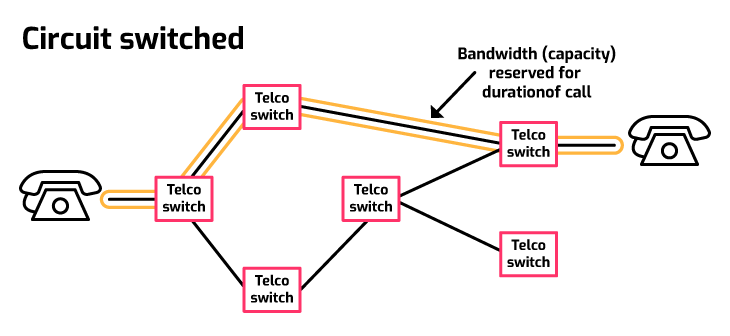
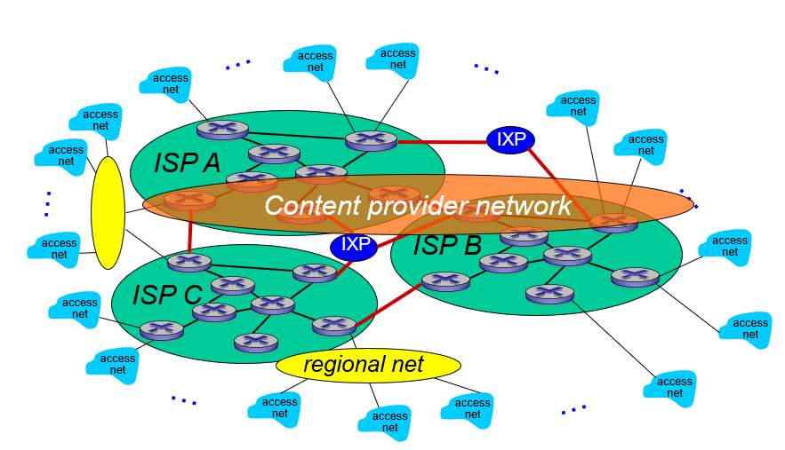
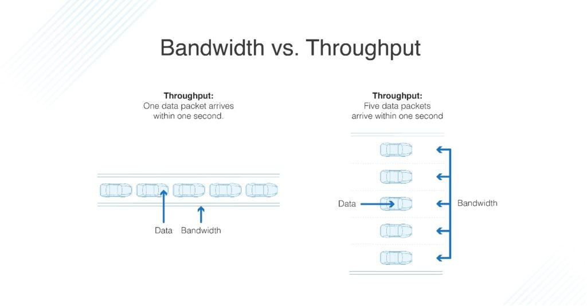
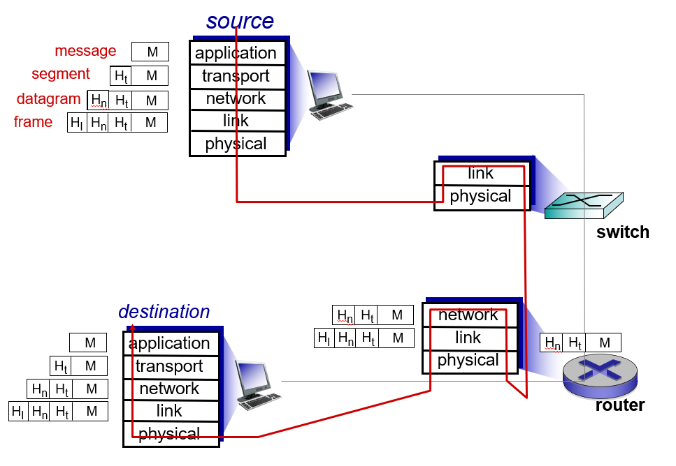
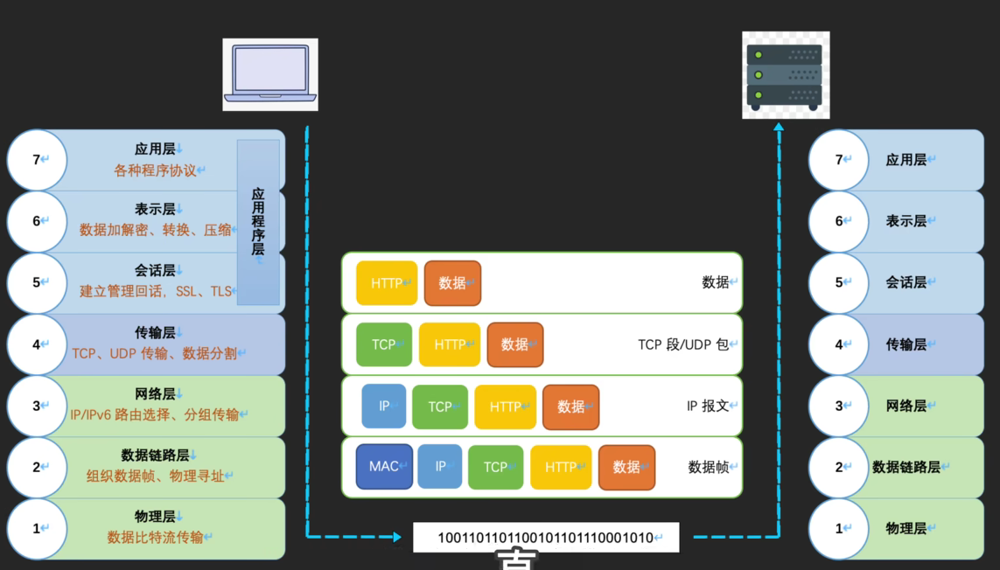

# Chapter 1: Introduction

## Overview

1. what is the Internet?
2. network edge
   end systems, access networks, links
3. network core
   packet switching, circuit switching, network structure
4. delay, loss, throughput in networks
5. protocol layers, service models
6. networks under attack: security
7. history

## What is the Internet？

### 互联网贡献组织

IETF (Internet Engineering Task Force)：互联网工程任务组， 成立于 1985 年，主要定义互联网标准。网址：[http://ietf.org](http://ietf.org)

我们平时提到的 RFC 文档都是他们的产物，例如常见的网络协议：IP、TCP、UDP、FTP、HTTP1.1 等。

RFC 文档也称请求注解文档（Requests for Comments），这是用于发布 Internet 标准和 Internet 其他正式出版物的一种网络文件或工作报告。RFC 文档初创于 1969 年，RFC 出版物由 RFC 编辑（RFC Editor）直接负责，并接受 IAB 的一般性指导。现在已经有 3000 多个 RFC 系列文件，并且这个数目还在不断增加, 内容和 Internet (开始叫做为 ARPANET) 相关。草案讨论了计算机通讯的方方面面，重点在网络协议，过程，程序，以及一些会议注解，意见，风格方面的概念。文档下载：[http://www.ietf.org/rfc.html](http://www.ietf.org/rfc.html)

### 网络七层协议

网络七层协议由上到下分为：应用层、表示层、会话层、传输层、网络层、数据链路层、物理层。

- 物理层：解决两个硬件之间怎么通信的问题，常见的物理媒介有光纤、电缆、中继器等。
- 数据链路层：在计算机网络中由于各种干扰的存在，物理链路是不可靠的。功能上，都是通过各种控制协议，将有差错的物理信道变为无差错的、能可靠传输数据帧的数据链路。
- 网络层：该层的主要任务就是：通过路由选择算法，为报文（该层的数据单位，由上一层数据打包而来）通过通信子网选择最适当的路径。这一层定义的是 IP 地址，通过 IP 地址寻址，所以产生了 IP 协议。
  IP（Internet Protocol）：互联网协议，是无连接的，不保证数据包的到达顺序和完整性，只负责将数据包发送给指定的电脑。
- 传输层：用于监控数据传输服务的质量，保证报文的正确传输。
  - TCP（Transmission Control Protocol）：传输控制协议，是面向连接的，保证数据包的到达顺序和完整性，通过握手、重传和排序等机制实现可靠的通信。
  - UDP（User Datagram Protocol）：用户数据报协议，是无连接的，不保证数据包的到达顺序和完整性，只负责将数据包发送给指定的程序。UDP 的头部信息很短，额外开销小，适合实时性要求高的应用。
- 会话层：建立和管理应用程序之间的通信。
- 表示层：负责数据格式的转换，将应用处理的信息转换为适合网络传输的格式，或者将来自下一层的数据转换为上层能处理的格式。
- 应用层：是计算机用户，以及各种应用程序和网络之间的接口，其功能是直接向用户提供服务，完成用户希望在网络上完成的各种工作。

### 互联网与万维网

- 互联网是一个全球性的网络网络，它由许多不同的设备和协议连接在一起，如电脑、手机、路由器、TCP/IP 等。
- 万维网是一个由许多互相链接的超文本组成的系统，它通过互联网访问，使用 HTTP 协议和 HTML 语言。
- 互联网是基础设施，而万维网是基础设施之上的服务。互联网还提供了其他服务，如电子邮件、即时通讯、文件传输等。

### Network Protocol

网络协议（Network Protocol）是使设备能够通过网络相互通信的规则，包含三个主要类型的网络协议：communication protocols, management protocols and security protocols。

- Communication protocols 包括基本数据通信工具，如 TCP/IP 和 HTTP。
- Management protocols 维护和管理网络工具，如 ICMP 和 SNMP。
- Security protocols 包括 HTTPS、SFTP 和 SSL2。

## Network Edge

### 设备

Network edge 是充当组织或服务提供商网络核心入口点的设备。它包括路由器、交换机、广域网 (WAN)、防火墙和集成接入设备 (IAD)。

#### Router 路由器

路由器在两个不同的网络之间传输数据包。此流量包括网站内容以及视频聊天、电子邮件和互联网协议语音 (VoIP) 传输等通信。路由器引导互联网上的流量，将其从一个点发送到另一个点，允许不同的边缘设备相互通信。

#### Switch 交换机

网络交换机通过数据包交换连接计算机网络中的设备，它接收数据，然后将其转发到目标设备。交换机允许边缘设备在不使用核心设备的情况下进行交互和共享资源。

#### Wide-area Network 广域网

WAN 由相互连接的局域网 (LAN) 组成。通过这种方式，WAN 边缘连接了 LAN 的边缘。例如，一个组织可以使用 WAN 或软件定义的 WAN (SD-WAN) 连接三个办公室，每个办公室都有自己的 LAN。

#### Firewall 防火墙

防火墙根据预定义的规则控制允许进入和退出网络基础设施的数据。防火墙检查数据包，寻找任何引起怀疑的东西，然后丢弃任何包含潜在威胁的数据包。防火墙是网络边缘的主要防线，可防止威胁进出。

#### Integrated Access Device 综合接入设备

IAD 转换不同类型的数据输入并将它们呈现为通用格式。例如，IAD 用于将模拟和数字电话信号转换为一个通用数字信号。 IAD 有助于简化通信并在边缘实现更高效的传输。

### DSL

DSL（Digital Subscriber Line）意为数字用户线路，是指以电话线为传输介质的传输技术组合。

### Host: Sends Packets of Data

包延时主要指将数据打包成一个个 Packages 需要的时间

$$
packet\ transmission\ delay \\
= time\ needed\ to\ transmit\ L(bit)\ packet\ into\ link
= \frac{L (bits)}{R (bits/sec)}
$$

网络延时是指一个数据包从源端发向目的端，然后再立即从目的端返回源端的时间。

### 网络连接方式

- Coaxial cable：由两个同轴铜导体构成。主要用于多频道有线电视和 HFC。
- Fiber optic cable：光纤电缆，特点是高速和低错误。
- Radio：无线电，电磁波谱信号进行。特点是没有 “物理连接”，大多有双向能力。有以下几种应用：
  - Terrestrial  microwave：地面微波
  - LAN：本地网络，如 WiFi
  - Wide-area：如移动网络 4G、5G 等
  - Satellite：卫星网络，如马斯克的星链

## The Network Core

### Packet Switching: 储存转发

- 发包/收包延迟：花费 L/R 秒，使用 R bps 的速率发收 L-bit 包
- store and forward：存储转发，整个数据包到达路由器之前必须传播/转发数据
- end-end delay：端对端延迟，等于 2L/R（假设传播延迟为 0）

### 延迟、丢包和抖动

> [延时、丢包、抖动是什么，该怎么办？ - 知乎 (zhihu.com)](https://zhuanlan.zhihu.com/p/21968527)
>
> 延时、丢包、抖动是互联网这个信息公路网无法避免的三个特点。假设我们现在有一百辆车从北京鸟巢开往上海东方明珠，并且每隔一分钟出发一辆。
>
> 延时：指的是每辆车从鸟巢开到东方明珠花的平均时间。显然，车队走高速公路肯定要比走各种小公路快很多，而且从鸟巢出发沿着怎样的路线开上高速公路也有很大影响，万一堵在了三环可就要多花好几个小时了。所以这个值和车队选择的行驶路线有关。互联网传输也是一样的道理，需要传输数据的两点之间经常是有很多可选路径的，而这些路径的延时往往相差很大。
>
> 丢包：指的是有的车无法在有效时间内无法达到终点，甚至可能永远也到不了终点。有的车可能永远堵在北京的三环上了，有的车可能中途出了车祸。假如我们的一百辆车里有五辆车因为各种原因没能按时到达上海，我们这次车队传输的“丢包率”就是 5%。是的，互联网传输也一样，它并不是百分百可靠的，总有数据无法按时传输到目的地。
>
> 抖动：指的是车子到达的顺序、间隔和出发时的差异。虽然我们的一百辆车在北京是等间隔的一分钟一辆出发的，但是它们到达上海时却并不是按顺序一分钟一辆到达的，甚至可能有晚出发的车比早出发的车先到的情况。互联网传输也一样，如果简单地按照收到的音视频数据顺序直接播放出来，就会出现失真的现象。

### 两个关键的网络核心功能

- routing: 确定源目的地路由数据包

- forwarding: 将数据包从路由器的输入移动到相应的路由器输出

#### 电路交换（Circuit switching）

FDM（Frequency Division Multiplexing）和 TDM（Time Division Multiplexing）是两种复用技术，用于在一个信道上传输多路信号。

- FDM 是将信道划分为多个不重叠的频率带，每个频带携带一路信号；TDM 是将信道划分为多个固定长度的时间片，每个时间片携带一路信号。
- FDM 只适用于模拟信号，TDM 既适用于模拟信号也适用于数字信号。
- FDM 需要设置保护频带以防止相邻频带之间的干扰，这会导致频率资源的浪费；TDM 不需要设置保护时间片，因此更有效地利用了时间资源。
- FDM 具有较低的延迟，因为每路信号都可以同时传输；TDM 具有较高的延迟，因为每路信号都要等待自己的时间片到来。
- FDM 的电路或芯片比较复杂，需要进行调制和解调；TDM 的电路或芯片比较简单，只需要进行开关和同步。

#### Packet switching 与 circuit switching

- Packet switching 是将数据分割成小块的分组（packet），每个分组都带有目的地址和序号，然后通过共享的网络独立地发送到目的地，最后在接收端重新组合成完整的数据。

  > [Structure of the internet — Isaac Computer Science](https://isaaccomputerscience.org/concepts/net_internet_structure?examBoard=all&stage=all)
  >
  > Traffic on the internet is transported as **packets**. An internet packet is made up of the data that is being transported, which is called the **payload**, and a **header**.
  >
  > Internet packets carry all sorts of payloads. For example, the data might be part of a web page, or an email, or a streamed audio track. The type of data is identified by the _protocol_ field within the header. Internet packets have a maximum size to prevent anything 'hogging' the bandwidth.
  >
  > The packets are moved around the internet using a method called **packet switching**. The use of relatively small data packets allows a data path to be shared. Different packets from the same 'conversation' may be sent over different routes. The internet has an **end-to-end** principle（原则） where the end points (source and destination) are responsible for checking that everything that has been sent is received, as appropriate. This type of communication between sender and receiver is known as connectionless (rather than dedicated). Most traffic over the internet uses packet switching and the internet is basically a **connectionless network**.

- Circuit switching 是在通信双方之间建立一条专用的物理连接（circuit），然后在这条连接上按顺序发送数据，直到通信结束才释放连接。

  > [Structure of the internet — Isaac Computer Science](https://isaaccomputerscience.org/concepts/net_internet_structure?examBoard=all&stage=all)
  >
  > Before the internet came into being, the largest global network was the telephone network. In some ways it was similar to the internet in that it was a collection of interconnected（互联的） networks. These interconnections were telephone exchanges or telephone switches.
  >
  > In this telephone network, if someone wished to make a call, a signal was sent across the connection to request the line. Each telephone switch would then select the appropriate route and reserve（预先，预定） capacity（容量） on the line and send the request on.
  >
  > 

简单的说，概念上两者的区别：

> Packet switch：按需分配
>
> Circuit switch：短时间包场

优缺点上：

- Packet switching 更有效地利用了网络资源，因为它可以动态地根据网络状况选择最佳路径，而不需要占用固定的带宽；circuit switching 则会造成带宽的浪费，因为它需要为每次通信保留一定量的带宽，即使没有数据传输也不能被其他用户使用。
- Packet switching 更适合于传输可变长度和突发性的数据，如互联网上的文件、邮件、视频等；circuit switching 更适合于传输固定长度和连续性的数据，如电话、传真等。
- Packet switching 由于分组可能经过不同的路径和顺序到达目的地，因此会导致较高的延迟和抖动；circuit switching 由于数据沿着固定的路径和顺序传输，因此会保证较低的延迟和抖动。
- Packet switching 由于分组可能在网络中丢失或损坏，因此需要更复杂的错误控制机制；circuit switching 由于数据在物理连接上传输，因此不需要错误控制机制。

### 互联网结构（Internet structure）: Network of networks

- 借助 ISP（Internet Service Providers，互联网服务提供商）通过访问端系统连接到互联网
- Access ISPs in turn must be interconnected（互相联系）, so that any two hosts can send packets to each other.
- Internet exchange point（IXP，互联网交换点）：它提供了一个物理位置，让互联网基础设施公司可以在不同的网络之间交换数据。IXP 通常是一个数据中心，其中 ISP 和 CDN 连接并交换互联网流量。包括云计算中心提供的服务。
- 有时还有不同国家之间的 regional net。
- Content provider network (e.g., Google, Microsoft, Akamai) may run their own network, to bring services, content close to end users.
- Network of networks is very complex.

## Delay, loss, throughput in networks

即网络中的延迟、丢失、吞吐量。

### 延迟 Delay

#### Transmission delay

将数据包从主机传输到传输介质所花费的时间称为传输延迟。

> [Delays in Computer Network - GeeksforGeeks](https://www.geeksforgeeks.org/delays-in-computer-network/)
>
> The time taken to transmit a packet from the host to the transmission medium is called Transmission delay.
>
> 
>
> Let $B$ bps is the bandwidth and $L$ bit is the size of the data then transmission delay is,
>
> $$
> Tt = L/B
> $$
>
> This delay depends upon the following factors:
>
> - If there are multiple active sessions, the delay will become significant(相当重要的).
> - Increasing bandwidth(带宽) decreases transmission delay.
> - MAC protocol largely influences the delay if the link is shared among multiple devices.
> - Sending and receiving a packet involves a context switch in the operating system, which takes a finite time.

#### Propagation delay

数据包传输到传输介质后，必须经过介质才能到达目的地。因此，数据包的最后一位到达目的地所花费的时间称为传播延迟。

> [Delays in Computer Network - GeeksforGeeks](https://www.geeksforgeeks.org/delays-in-computer-network/)
>
> After the packet is transmitted to the transmission medium, it has to go through the medium to reach the destination. Hence the time taken by the last bit of the packet to reach the destination is called propagation delay.
>
> 
>
> Factors affecting propagation delay:
>
> 1.  **Distance**: It takes more time to reach the destination if the distance of the medium is longer.
> 2.  **Velocity**: If the velocity(speed) of the signal is higher, the packet will be received faster.
>
> $$
> Tp = Distance / Velocity
> $$
>
> **Note:**
>
> $$
> Velocity =3 \cdot 10^8 m/s \ (for air) \\
> Velocity= 2.1 \cdot 10^8 m/s \  (for optical fibre)
> $$

#### Queueing delay

让数据包被目的地接收，数据包不会立即被目的地处理。它必须在称为缓冲区的队列中等待。所以它在被处理之前在队列中等待的时间称为排队延迟。

> [Delays in Computer Network - GeeksforGeeks](https://www.geeksforgeeks.org/delays-in-computer-network/)
>
> Let the packet is received by the destination, the packet will not be processed by the destination immediately. It has to wait in a queue in something called a buffer. So the amount of time it waits in queue before being processed is called queueing delay.
>
> In general, we can’t calculate queueing delay because we don’t have any formula for that.
>
> This delay depends upon the following factors:
>
> - If the size of the queue is large, the queuing delay will be huge. If the queue is empty there will be less or no delay.
> - If more packets are arriving in a short or no time interval, queuing delay will be large.
> - The less the number of servers/links, the greater is the queuing delay.

#### Processing delay

现在数据包将被用于处理，称为处理延迟。处理器处理数据包所花费的时间是中间路由器决定将数据包转发到何处、更新 TTL、执行报头校验和计算所需的时间。

> [Delays in Computer Network - GeeksforGeeks](https://www.geeksforgeeks.org/delays-in-computer-network/)
>
> Now the packet will be taken for the processing which is called processing delay.
>
> Time is taken to process the data packet by the processor that is the time required by intermediate routers to decide where to forward the packet, update TTL, perform header checksum(校验) calculations.
>
> It also doesn’t have any formula since it depends upon the speed of the processor and the speed of the processor varies from computer to computer.
>
> This delay depends upon the following factors:
>
> - It depends on the speed of the processor.
>
> $$
> Ttotal = Tt + Tp + Tq + Tpro
> $$

### Packet loss 丢包

- queue (aka(别称) buffer) preceding(提前的) link in buffer has finite capacity(容量)
- packet arriving to full queue dropped (aka lost)
- lost packet may be retransmitted by previous node, by source end system, or not at all（压根没送）

### Throughput 吞吐量

Rate (bits/time unit) at which bits transferred between sender/receiver

类比物理当中定义的”速度“：

- instantaneous(瞬时): rate at given point in time
- average(平均): rate over longer period of time

Link on end-end path that constrains(约束) end-end throughput.

> [Bandwidth and Throughput in Networking: Guide and Tools - DNSstuff](https://www.dnsstuff.com/network-throughput-bandwidth)
>
> So, how do we define throughput? Again, network throughput refers to how much data can be transferred from source to destination within a given timeframe. **Throughput measures how many packets arrive at their destinations successfully.** For the most part, throughput capacity **is measured in bits per second,** but it can also be measured in data per second.
>
> **Packet loss, latency(延迟), and jitter(抖动) are all related to slow throughput speed**. Latency is the amount of time it takes for a packet to make it from source to destination, and jitter refers to the difference in packet delay. Minimizing all these factors is critical to increasing throughput speed and data performance.
>
> 
>
> **You can think of bandwidth as a tube and data throughput as sand**. If you have a large tube, you can pour more sand through it at a faster rate. Conversely, if you try to put a lot of sand through a small tube, it will go very slowly.

## Protocol layers, service models

Layers: each layer implements(实现) a service, relies on services provided by layer below

### OSI

OSI 是 Open System Interconnect 的缩写，意为开放式系统互联。

7 层是指 OSI 七层协议模型，主要是：应用层（Application）、表示层（Presentation）、会话层（Session）、传输层（Transport）、网络层（Network）、数据链路层（Data Link）、物理层（Physical）。

最后 3 层也被统称为应用程序层。

> [OSI 七层模型详解 小鹏\_加油的博客](https://blog.csdn.net/yaopeng_2005/article/details/7064869)
>
> 
>
> #### 物理层
>
> 在 OSI 参考模型中，物理层（Physical Layer）是参考模型的最低层，也是 OSI 模型的第一层。
>
> 物理层的主要功能是：利用传输介质为数据链路层提供物理连接，实现比特流的透明传输。
>
> 物理层的作用是实现相邻计 算机节点之间比特流的透明传送，尽可能屏蔽掉具体传输介质和物理设备的差异。使其上面的数据链路层不必考虑网络的具体传输介质是什么。“透明传送比特流”表示经实际电路传送后的比特流没有发生变化，对传送的比特流来说，这个电路好像是看不见的。
>
> #### 数据链路层
>
> 数据链路层（Data Link Layer）是 OSI 模型的第二层，负责建立和管理节点间的链路。该层的主要功能是：通过各种控制协议，将有差错的物理信道变为无差错的、能可靠传输数据帧的数据链路。
>
> 在计算机网络中由于各种干扰的存在，物理链路是不可靠的。因此，这一层的主要功能是在物理层提供的比特流的基础上，通过差错控制、流量控制方法，使有差错的物理线路变为无差错的数据链路，即提供可靠的通过物理介质传输数据的方法。
>
> 该层通常又被分为介质访问控制（MAC）和逻辑链路控制（LLC）两个子层：
>
> - MAC 子层的主要任务是解决共享型网络中多用户对信道竞争的问题，完成网络介质的访问控制；
> - LLC 子层的主要任务是建立和维护网络连接，执行差错校验、流量控制和链路控制。
>
> 数据链路层的具体工作是接收来自物理层的位流形式的数据，并封装成帧，传送到上一层；同样，也将来自上层的数据帧，拆装为位流形式的数据转发到物理层；并且，还负责处理接收端发回的确认帧的信息，以便提供可靠的数据传输。
>
> #### 网络层
>
> 网络层（Network Layer）是 OSI 模型的第三层，它是 OSI 参考模型中最复杂的一层，也是通信子网的最高一层。它在下两层的基础上向资源子网提供服务。
>
> 其主要任务是：通过路由选择算法，为报文或分组通过通信子网选择最适当的路径。该层控制数据链路层与传输层之间的信息转发，建立、维持和终止网络的连接。具体地说，数据链路层的数据在这一层被转换为数据包，然后通过路径选择、分段组合、顺序、进/出路由等控制，将信息从一个网络设备传送到另一个网络设备。
>
> 一般地，数据链路层是解决同一网络内节点之间的通信，而网络层主要解决不同子网间的通信。例如在广域网之间通信时，必然会遇到路由（即两节点间可能有多条路径）选择问题。
>
> 在实现网络层功能时，需要解决的主要问题如下：
>
> - 寻址：数据链路层中使用的物理地址（如 MAC 地址）仅解决网络内部的寻址问题。在不同子网之间通信时，为了识别和找到网络中的设备，每一子网中的设备都会被分配一个唯一的地址。由于各子网使用的物理技术可能不同，因此这个地址应当是逻辑地址（如 IP 地址）。
> - 交换：规定不同的信息交换方式。常见的交换技术有：线路交换技术和存储转发技术，后者又包括报文交换技术和分组交换技术。
> - 路由算法：当源节点和目的节点之间存在多条路径时，本层可以根据路由算法，通过网络为数据分组选择最佳路径，并将信息从最合适的路径由发送端传送到接收端。
> - 连接服务：与数据链路层流量控制不同的是，前者控制的是网络相邻节点间的流量，后者控制的是从源节点到目的节点间的流量。其目的在于防止阻塞，并进行差错检测。
>
> #### 传输层
>
> OSI 下 3 层的主要任务是数据通信，上 3 层的任务是数据处理。而传输层（Transport Layer）是 OSI 模型的第 4 层。因此该层是通信子网和资源子网的接口和桥梁，起到承上启下的作用。
>
> 该层的主要任务是：向用户提供可靠的端到端的差错和流量控制，保证报文的正确传输。传输层的作用是向高层屏蔽下层数据通信的细节，即向用户透明地传送报文。该层常见的协议：TCP/IP 中的 TCP 协议、Novell 网络中的 SPX 协议和微软的 NetBIOS/NetBEUI 协议。
>
> 传输层提供会话层和网络层之间的传输服务，这种服务从会话层获得数据，并在必要时，对数据进行分割。然后，传输层将数据传递到网络层，并确保数据能正确无误地传送到网络层。因此，传输层负责提供两节点之间数据的可靠传送，当两节点的联系确定之后，传输层则负责监督工作。
>
> 综上，传输层的主要功能如下：
>
> - 传输连接管理：提供建立、维护和拆除传输连接的功能。传输层在网络层的基础上为高层提供“面向连接”和“面向无接连”的两种服务。
> - 处理传输差错：提供可靠的“面向连接”和不太可靠的“面向无连接”的数据传输服务、差错控制和流量控制。在提供“面向连接”服务时，通过这一层传输的数据将由目标设备确认，如果在指定的时间内未收到确认信息，数据将被重发。
>
> #### 会话层
>
> 会话层（Session Layer）是 OSI 模型的第 5 层，是用户应用程序和网络之间的接口，主要任务是：向两个实体的表示层提供建立和使用连接的方法。将不同实体之间的表示层的连接称为会话。因此会话层的任务就是组织和协调两个会话进程之间的通信，并对数据交换进行管理。
>
> 用户可以按照半双工、单工和全双工的方式建立会话。当建立会话时，用户必须提供他们想要连接的远程地址。而这些地址与 MAC（介质访问控制子层）地址或网络层的逻辑地址不同，它们是为用户专门设计的，更便于用户记忆。域名（DNS）就是一种网络上使用的远程地址，例如 `www.baidu.com` 就是一个域名。
>
> 会话层的具体功能如下：
>
> - 会话管理：允许用户在两个实体设备之间建立、维持和终止会话，并支持它们之间的数据交换。例如提供单方向会话或双向同时会话，并管理会话中的发送顺序，以及会话所占用时间的长短。
> - 会话流量控制：提供会话流量控制和交叉会话功能。
> - 寻址：使用远程地址建立会话连接。
> - 出错控制：从逻辑上讲会话层主要负责数据交换的建立、保持和终止，但实际的工作却是接收来自传输层的数据，并负责纠正错误。会话控制和远程过程调用均属于这一层的功能。但应注意，此层检查的错误不是通信介质的错误，而是磁盘空间、打印机缺纸等类型的高级错误。
>
> ### 表示层
>
> 表示层（Presentation Layer）是 OSI 模型的第六层，它对来自应用层的命令和数据进行解释，对各种语法赋予相应的含义，并按照一定的格式传送给会话层。其主要功能是“处理用户信息的表示问题，如编码、数据格式转换和加密解密”等。
>
> 表示层的具体功能如下：
>
> - 数据格式处理：协商和建立数据交换的格式，解决各应用程序之间在数据格式表示上的差异。
> - 数据的编码：处理字符集和数字的转换。例如由于用户程序中的数据类型（整型或实型、有符号或无符号等）、用户标识等都可以有不同的表示方式，因此，在设备之间需要具有在不同字符集或格式之间转换的功能。
> - 压缩和解压缩：为了减少数据的传输量，这一层还负责数据的压缩与恢复。
> - 数据的加密和解密：可以提高网络的安全性。
>
> ### 应用层
>
> 应用层（Application Layer）是 OSI 参考模型的最高层，它是计算机用户，以及各种应用程序和网络之间的接口，其功能是直接向用户提供服务，完成用户希望在网络上完成的各种工作。它在其他 6 层工作的基础上，负责完成网络中应用程序与网络操作系统之间的联系，建立与结束使用者之间的联系，并完成网络用户提出的各种网络服务及应用所需的监督、管理和服务等各种协议。此外，该层还负责协调各个应用程序间的工作。
>
> 应用层为用户提供的服务和协议有：文件服务、目录服务、文件传输服务（FTP）、远程登录服务（Telnet）、电子邮件服务（E-mail）、打印服务、安全服务、网络管理服务、数据库服务等。上述的各种网络服务由该层的不同应用协议和程序完成，不同的网络操作系统之间在功能、界面、实现技术、对硬件的支持、安全可靠性以及具有的各种应用程序接口等各个方面的差异是很大的。
>
> 应用层的主要功能如下：
>
> - 用户接口：应用层是用户与网络，以及应用程序与网络间的直接接口，使得用户能够与网络进行交互式联系。
> - 实现各种服务：该层具有的各种应用程序可以完成和实现用户请求的各种服务。

### Encapsulation

从上往下，每经过一层，协议就会在数据包包头上面做点手脚，加点东西，传送到接收端，再层层解 套出来，如下示意图：

## Networks under attack: security

### Put malware into hosts via Internet

malware：恶意软件，指电脑病毒等

- virus: self-replicating(自我复制) infection(感染) by receiving/executing(执行) object (e.g., e-mail attachment)
- worm: self-replicating infection by passively(被动地) receiving object that gets itself executed

### Attack server, network infrastructure

Denial of Service (DoS，拒绝服务): attackers make resources (server, bandwidth) unavailable to legitimate traffic by overwhelming resource with bogus traffic.

造成 DoS 的攻击行为被称为 DoS 攻击，将大量的非法申请封包传送给指定的目标主机，其目的是完全消耗目标主机资源，使计算机或网络无法提供正常的服务。

## History

### 计算机网络的发展阶段

- 第一代：远程终端连接
  20 世纪 60 年代早期

  > 面向终端的计算机网络：主机是网络的中心和控制者，终端（键盘和显示器）分布在各处并与主机相连，用户通过本地的终端使用远程的主机。
  > 只提供终端和主机之间的通信，子网之间无法通信。

- 第二代：计算机网络阶段（局域网）
  20 世纪 60 年代中期

  > 多个主机互联，实现计算机和计算机之间的通信。
  > 包括：通信子网、用户资源子网。
  > 终端用户可以访问本地主机和通信子网上所有主机的软硬件资源。
  > 电路交换和分组交换。

- 第三代：计算机网络互联阶段（广域网、Internet）
  1981 年国际标准化组织(ISO)制订：开放体系互联基本参考模型（OSI/RM），实现不同厂家生产的计算机之间实现互连。

  > TCP/IP 协议的诞生。

- 第四代：信息高速公路（高速，多业务，大数据量）

  > 宽带综合业务数字网：信息高速公路
  > ATM 技术、ISDN、千兆以太网
  > 交互性：网上电视点播、电视会议、可视电话、网上购物、网上银行、网络图书馆等高速、可视化。
