# Chapter 3: Transport Layer

## Outline

1. Transport-layer services
2. Multiplexing and demultiplexing
3. Connectionless transport: UDP
4. Principles of reliable data transfer
5. Connection-oriented transport: TCP

   - segment structure
   - reliable data transfer
   - flow control
   - connection management

6. Principles of congestion control
7. TCP congestion control

## Transport-layer services

### Transport vs. network layer

网络层是协议栈中的第三层，负责处理互联网上每个主机之间的路由。该层有两个主要的任务：

1. 选择最佳路径将数据包发送到目标地址；
2. 控制每个数据包在网络中的传输。网络层协议常用的是 IP（Internet Protocol），它定义了如何通过互联网把数据包从源主机传输到目标主机。

传输层是协议栈中的第四层，是端到端通信的主要协议。传输层实现了数据传输的可靠性，并采用流控制和拥塞控制等机制来协调系统中的数据流。该层的两个最常用的协议是 TCP（Transmission Control Protocol）和 UDP（User Datagram Protocol）。TCP 提供可靠的数据传输，而 UDP 则提供无连接、不可靠和基于报文的传输。

因此，网络层和传输层具有不同的目的和职责。网络层处理路由和数据包转发，而传输层负责端到端通信可靠性，数据流控制和拥塞控制等方面的任务。

## Multiplexing and demultiplexing

> [计算机网络：多路复用（Multiplexing） VS 多路分解（Demultiplexing）\_计算机 demultiplexing_SongXJ--的博客-CSDN 博客](https://blog.csdn.net/SongXJ_01/article/details/106880461)
>
> ### Multiplexing 多路复用
>
> 从源主机的不同套接字（socket）中收集数据块，并为每个数据块封装上首部信息（这将在多路分解时使用）从而生成报文段（segment），然后将报文段传递到网络层的工作称为多路复用。
>
> - 在 TCP 或者 UDP 传输过程中，数据需要被不同程序识别，multiplexing 因此诞生
> - 一般情况下 multiplexing 有以下几个 field 用于区分不同程序所需要的数据 source ip, source port, destination ip, destination port
>
> ### Demultiplexing 多路分解
>
> 将传输层报文段中的数据交付到正确的套接字的工作称为多路分解。
>
> - 通过检验上述 field, 传输协议（transport layer protocol）将不同数据包发送至正确的 socket port
> - 0-1023 是被各种协议占用的端口，1024-65535 是一般程序可用的端口

## Connectionless transport: UDP

### UDP: User Datagram Protocol [RFC 768]

基础原理已经在 [Chapter 2@Client/server socket: UDP](./02-application-layer#client-server-socket-udp) 讲过，不再赘述。

### UDP: segment header

> [Segmentation Explained with TCP and UDP Header (computernetworkingnotes.com)](https://www.computernetworkingnotes.com/ccna-study-guide/segmentation-explained-with-tcp-and-udp-header.html)
>
> ### Segmentation
>
> Segmentation is the process of dividing large data stream into smaller pieces. This functionality allows a host to send or receive a file of any size over the any size of network. For example, if network bandwidth is 1 Mbps and file size is 100 Mb, host can divide the file in 100 or more pieces. Once a piece becomes less or equal to the network bandwidth in size, it can be transferred easily. Destination host, upon(在…之后) receiving all pieces, joins them back to reproduce the original file.
>
> If an application wants to use UDP to send its data, it can’t give the data to UDP in actual size. It has to use its own mechanism(机制) to detect whether segmentation is required or not. And if segmentation is required, it has to do it on its own before giving data to UDP.
>
> ### Packing data for transmission
>
> Both protocols pack data in similar fashion. Both add a header with each data piece. A header mainly contains two types of information;
>
> 1. The information that is required to send the segment at the correct destination.
> 2. The information that is required to support the protocol specific features.
>
> ### How UDP Work with header
>
> UDP neither provides any protocol specific service, nor adds any additional information in the header.
>
> Following figure shows data with UDP header.
>
> 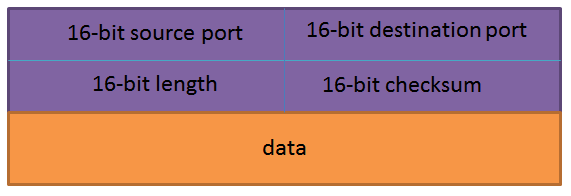
>
> | Field            | Description                                                                       |
> | ---------------- | --------------------------------------------------------------------------------- |
> | Source port      | Port number of the application that is transmitting data from the source computer |
> | Destination port | Port number of the application that will receive the data at destination.         |
> | Length           | Denotes the length of the UDP header and the UDP data                             |
> | Checksum         | CRC of the complete segment                                                       |
> | Data             | Data which it received from the application                                       |

### UDP checksum

Goal: detect “errors” (e.g., flipped bits(比特位的翻转)) in transmitted segment

UDP（用户数据报协议）checksum 是一种用于检测 UDP 数据包完整性的简单校验和。当 UDP 数据包被发送到网络时，发送端计算校验和并将其添加到 UDP 数据包中的 checksum 字段中。接收端通过再次计算校验和并将其与数据包的 checksum 字段进行比较来检测数据包是否在传输过程中出现任何错误或损坏。如果计算出的校验和不匹配，则数据包被认为是损坏的。UDP 校验和是 UDP 协议的一项重要功能，可确保数据在传输过程中的完整性和正确性。

## Principles of reliable data transfer

Characteristics(特点) of unreliable channel will determine(决定) complexity of reliable data transfer protocol.

::: tip
Reliable data transfer(rdt) 即可靠传输。
:::

部分内容来自 [网络协议 7：【传输层】可靠传输（rdt）的原理 - 掘金 (juejin.cn)](https://juejin.cn/post/7030066301062086670)，有删改

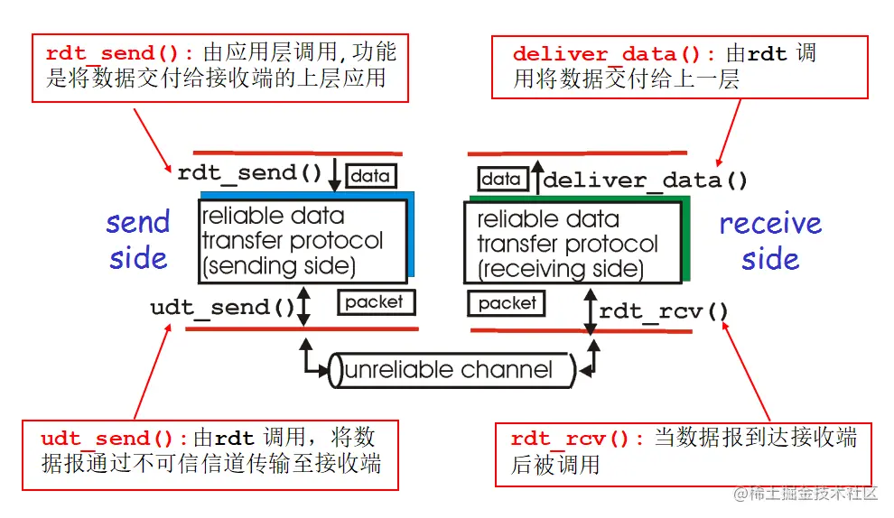

### rdt 1.0

rdt 1.0 是基于**理想情况下**的协议，假设所有信道都是可靠的——没有比特位的翻转，没有数据包的丢失与超时。所以 rdt 1.0 的传输功能就是：**发送方发送数据，接收方等着接受数据**。

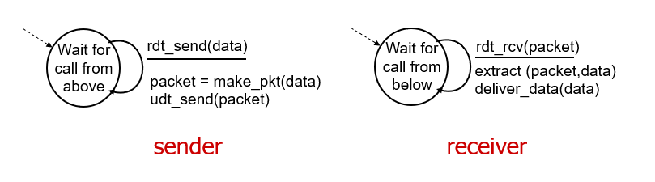

### rdt 2.0

- rdt 2.0 在 rdt1.0 的基础上考虑了 **bit errors**，即，不可信信道中数据包中的 1 可能会变 0，0 可能会变成 1。rdt2.0 的任务是**发现并修复**这些 bit errors
- rdt 1.0 中接受者和发送者固定，rdt2.0 引入有限状态自动机 finite state machines (FSM) 来切换指定发送者和接受者

::: tip Finite State Machines
即只有有限种状态的，在特定条件下能切换状态的机器。比如刷卡就转的这种门禁机器。
:::

rdt 2.0 增加了 3 种新机制来提升：

1. 通过 checksum 来错误校验

2. 接收者反馈接受正误信息（Acknowledgements）：

   - acknowledgements (ACKs): receiver explicitly(明确地) tells sender that pkt() received OK
   - negative acknowledgements (NAKs): receiver explicitly tells sender that pkt had errors

   ::: tip

   这也叫做停等协议（Stop and wait）：

   sender sends one packet, then waits for receiver response

   :::

3. 出错就重传

即，传输层对应用层的数据进行打包处理时，新增 checksum（校验和），从而接收端可以对其数据包进行检验，如果正确，返回 ACK，发送者继续发送下一个数据包；如果不正确，返回 NAK，发送者重传数据。

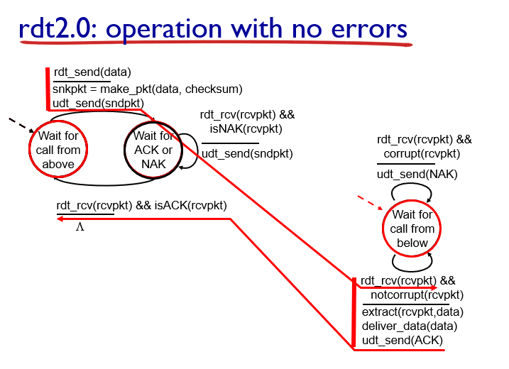

但如果客户端在接受后反馈信息 ACKs 在传输过程中出现问题，导致回答的内容在服务端看来并非 ACKs，服务端/发送端会重新回传内容。

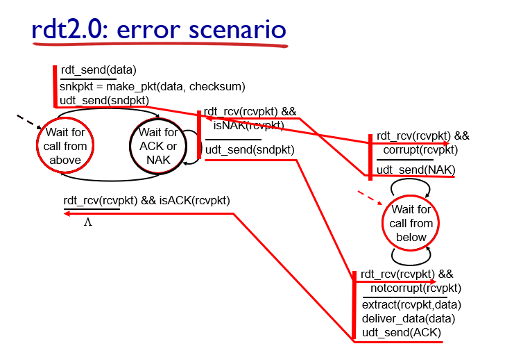

这也是 rdt 2.0 的一些大问题。不能只是简单地重发，可能重复了就麻烦了。因此 rdt 2.1 应运而生。

### rdt 2.1

如何解决重复呢：

- 如果 ACK 或者 NAK 错了，corrupted(损坏) 了，还是重发
- 但是这回，发送方在打包数据包时添加了 0 或者 1 编号 sequence number (seq)
  - 两个状态就够啦，一次只发送一个未经确认的分组
- sender 就有 0 号数据包和 1 号 package 两种；receiver 也有了 2 种状态等待 0 号 package 和等待 1 号 package
- receiver 把序列重复的删了不接受即可
  - receiver 也不知道发送方是否正确收到了其 ACK/NAK
- 需要“stop and wait”，发送方发送一个 package，然后等待接收方响应

对于 Sender：

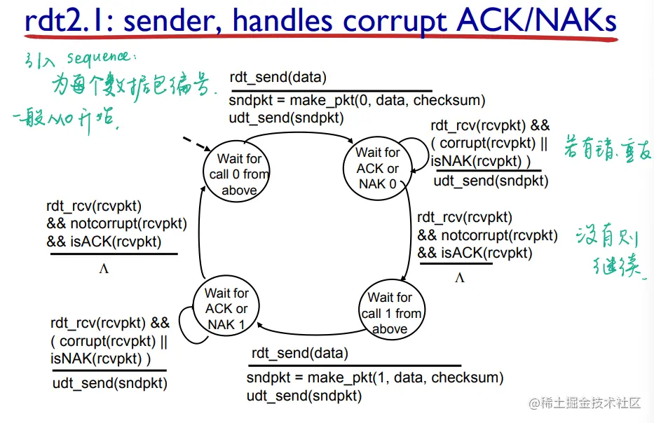

对于 Receiver：

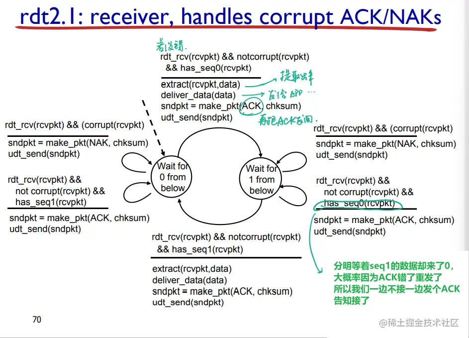

整体（基本上记这个就差不多）：

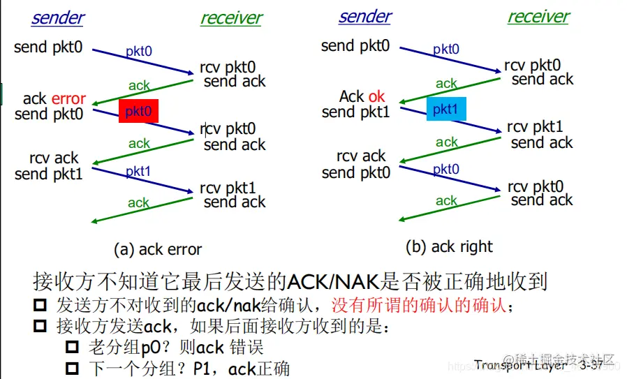

### rdt 2.2

做了一点点微不足道的改进，再见啦 NAK，ACK 就够了

**我们在 ACK 的信息上加上了顺序号**：sender 发送 0 号数据包，如果接收方正确接收到 0 号，返回（ACK0），发送方接着发送 1 号数据包。如果接收方没有接收到 0 号数据包或出现错误，返回（ACK1），发送方重传 0 号数据包。

::: tip
相当于抽象成了“若不符合要求，重发”和“发新的”两个选项
:::

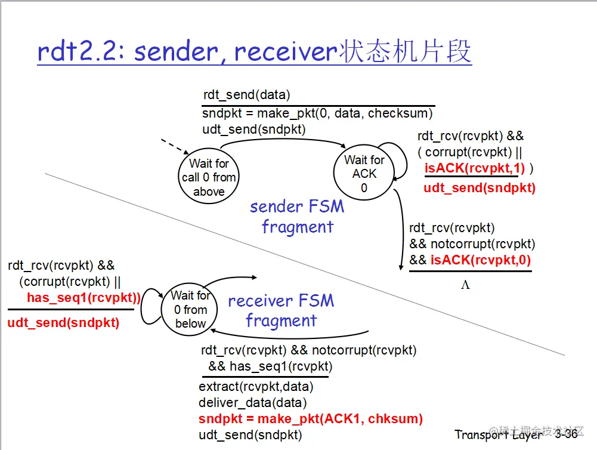

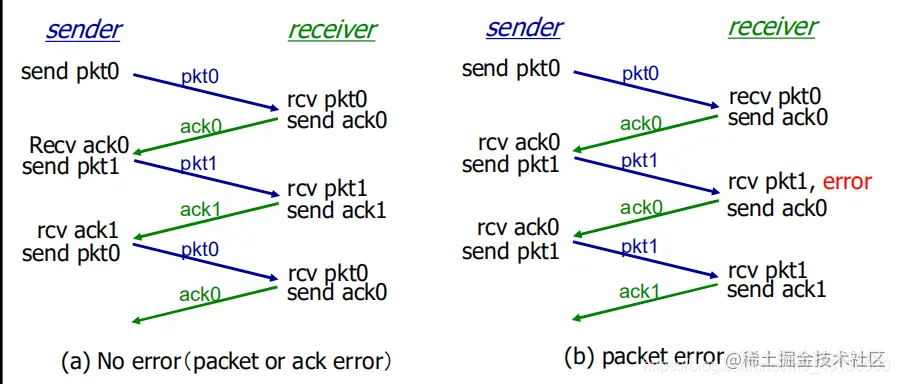

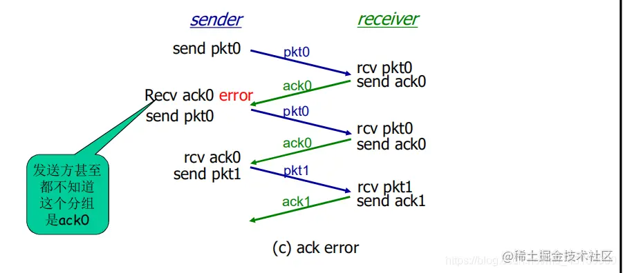

### rdt 3.0

rdt2.2 之前的版本都重在处理数据包的 bit errors 情况，却没有考虑到数据包在传输过程中出现的**数据包或者 ACKs 丢失**问题，这样数据包丢失会使得网络处于拥塞状态

机制（解决方法）：在超过合理时间（reasonable amount of time，同 TCP）后重传

- 发送端超时重传：如果到时没有收到 ACK->重传
- 如果 package（或 ACK）只是被延迟了：
  - 重传将会导致数据重复，但利用序列号已经可以处理这个问题
  - 接收方必须指明被正确接收的序列号
- 需要一个倒计数定时器

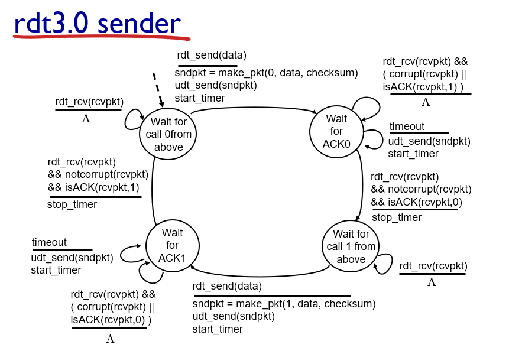

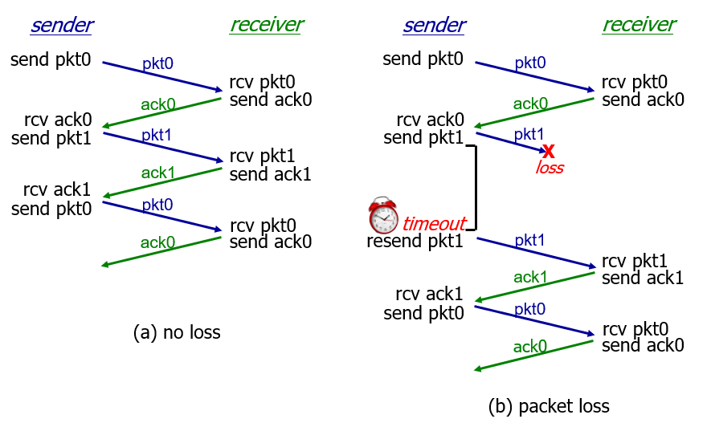

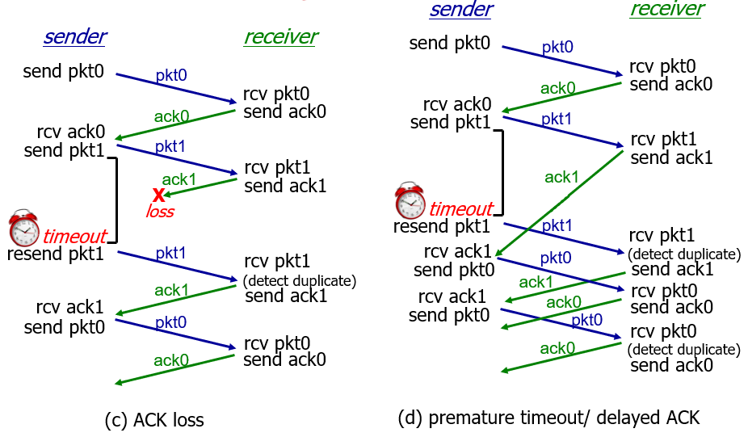

过早超时(延迟的 ACK)也能够正常工作：但是效率较低，一半包和确认是重复的。

> [RDT 协议（可靠数据传输协议）\_计算机网络 rdt_remiliko 的博客-CSDN 博客](https://blog.csdn.net/m0_63657524/article/details/121916128)
>
> 计算机网络通过对网络进行分层设计，将一个庞大而复杂的系统，模块化层次化，（ 大致分层如图 2.1 所示 ） 其中的每个层次为其上层提供特定的服务内容，并使用来自下层的特定功能，各个层次中明确了其需要实现的内容，但并不指明其中具体的实现方式。
>
> 运行在应用层中的客户端（服务端）应用程序进程通过套接字将数据推送到运输层。同样地，有服务端（客户端）进程通过套接字接受来自运输层的数据。对应用层而言，它所能看到的底层就是一条可靠的信道（如图 2.2 所示）。但是，对于现实中的数据传输，由于受到噪声干扰、网络拥堵等各种影响，难免会出现数据受损、丢包等事故，而 rdt 协议就是为了解决这样一个问题，而诞生的。
>
> 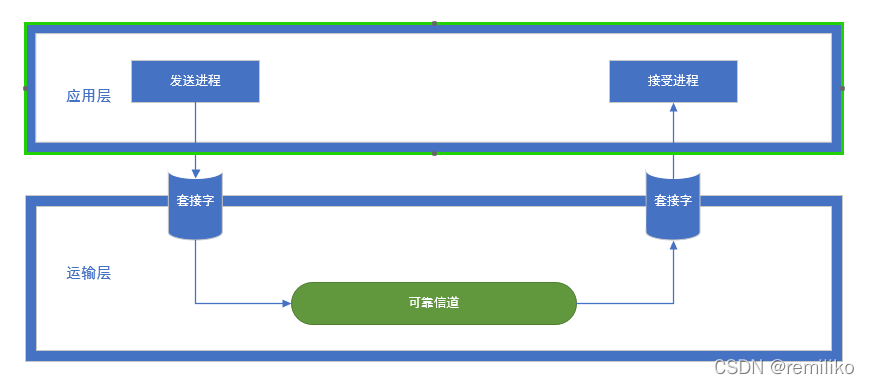
>
> rdt 协议的实现
>
> 参考《计算机网络自顶向下》这本书，在这里我们从简单到复杂来探讨这个协议的实现过程（要注意的是，我们在此处探讨的 rdt 协议是建立在（stop-and-wait）停等协议上的。
>
> 首先，先将各个部分做好定义和命名初始化处理, 为进一步探讨协议做好准备。
>
> 我们将数据的发送方设定为 sender，接收方设定为 receptor，发送方和接收方各自维护一个自己 FSM(Finite-State-Machine)有限状态机，用于记录当前的状态。我们用状态来描述发送方和接收方在执行通讯各个时期的特征。
>
> ### rdt 协议 1.0
>
> 在 rdt 1.0 中我们只专注于考虑如何实现核心功能，而不去考虑其他异常。因此我们在此处假定两个应用层之间存在着这么一条可靠信道，它可以保证从应用层的一侧到另一侧数据不丢失，因此此时的发送方和接收方只会有一个状态。
>
> - 发送方： 等待应用程序下发调用指令，发送数据
>
> - 接收方： 等待来自下层的调用指令，接受数据并缓存
>
> 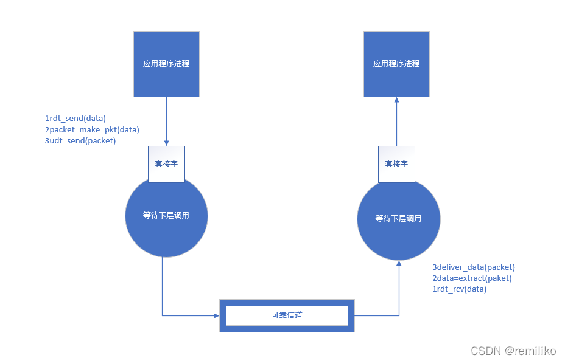
>
> 数据流动情况分析
>
> sender：
>
> - 应用进程调用 rdt_send（data）方法，将数据推送至运输层
> - 运输层调用 make_pkt 方法，将源自于应用程序的报文分组打包成报文段
> - 运输层调用 udt_send 方法，将报文段推送至信道
>
> receptor：
>
> - 较低层（比运输层低的层次）执行 ret_rev 方法，将数据推送到运输层
> - 运输层调用 extract，从报文段中提取出数据（可能涉及分组等细节实现，此处不作探讨）
> - 运输层调用 deliver_data 方法将数据推送至应用层
>
> 此时，我们就可以简单地实现让数据从 sender 端传输到 receptor 端了，当然此时距离可靠数据传输还有一定的距离。因此，在 rdt2.0 及以后的版本我们开始考虑当异常事件发生的时候，如何保证数据的可靠性
>
> ### rdt 协议 2.0
>
> 在 rdt 2.0 首先考虑比特差错出现的情况，比特差错通常会出现在可能受损的物理部件之中，因此需要引入比特差错矫正的功能。（udp 的比特差错校验方法）在考虑出现比特差错事件发生的 rdt 2.0 中，需要加入 肯定确认（ACK positive acknowledgement）、否定确认（NAK negative acknowledgement）的情况。对于否定确认的报文，需要提示发送方重新发送该数据（数据恢复）。基于这种重传机制的可靠数据传输协议称为 自动重传协议（Automatic Repeat reQuest，ARQ）
>
> 于是 Sender 方需要增加一个状态，等待 ACK 或 NAK，整个 rdt 2.0 执行流程如图所示：
>
> 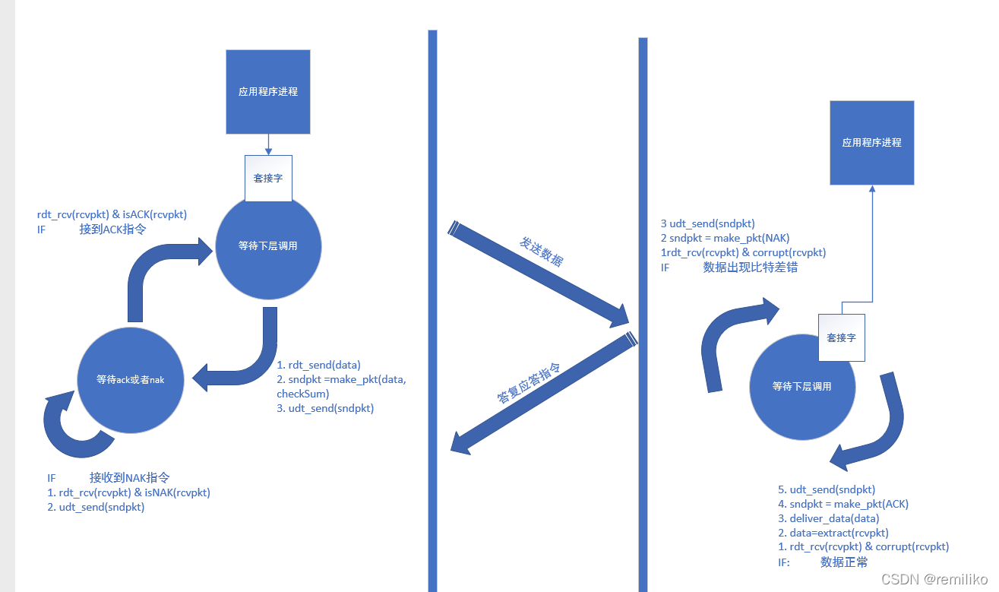
>
> 数据流动情况分析
>
> Sender 端：
>
> - 应用层调用 rdt_send 方法，将数据推送至应用层
>
> - 应用层调用 make_pdt 将数据打包成报文段，并在报文段中封装进一个 校验码
> - 应用层调用 udt_send 方法将打包完成的报文段推送至信道
> - Sender 端 此时状态迁移为 等待 ACK 应答 或者 NAK 应答状态
>
> Receptor 端：
>
> - 较低层通过 rdt_rcv 方法，将数据推送到运输层
> - 运输层接收到报文段，对报文段数据进行校验处理，校验成功则执行第 4 步，校验失败则跳转到第 3 步
> - 发送 NAK 指令，继续等待较低层的调用
> - 发送 ACK 指令，继续等待较低层的调用
>
> Sender 端：
>
> - 接收到 NAK 应答指令执行第 2 步，接收到 ACK 执行第 3 步
> - 接收到 NAK，Sender 直接将打包好的数据再一次通过 udt_send 方法推送到信道, 保持等待 ACK 或 NAK 指令状态
> - 接受到 ACK，Sender 端不再阻塞，可以发送新的数据，状态迁移为等待上层调用状态
>
> 需要注意的是：由于在这里讨论的 rdt 协议采用了停等协议。因此，Sender 端在等待 ACK 和 NAK 答复指令的时候，处在阻塞的状态。
>
> ### rdt 协议 2.1
>
> （rdt 2.1 为什么不效仿 rdt 2.0 中，让 receptor 端去接受一个 ack 或 nak，这是因为可能出现一个比较有趣的问题，这个问题后续讨论）
>
> 数据流动如图所示：
>
> 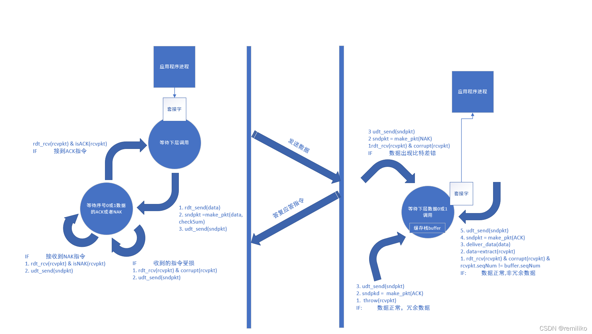
>
> 数据流动情况分析
>
> Sender 端：
>
> - 应用层调用 rdt_send 方法，将数据推送至应用层
>
> - 应用层调用 make_pdt 将数据打包成报文段，并在报文段中封装进一个 校验码和一个值为 0 或 1 的序号
> - 应用层调用 udt_send 方法将打包完成的报文段推送至信道
> - Sender 端 此时状态迁移为 等待序号为 0 或 1 的报文段 ACK 应答 或 NAK 应答状态
>
> Receptor 端：
>
> - 较低层通过 rdt_rcv 方法，将数据推送到运输层
>
> - 运输层接收到报文段，对报文段数据进行校验处理，校验成功则执行第 4 步，校验失败则执行第 3 步
> - 发送 NAK 指令，继续等待下层调用
> - 检测数据序号，如果是冗余数据，直接丢弃数据，发送对缓存栈中数据的 ACK 指令，对于非冗余数据，则将数据置换到缓存栈之中，发送一个确认对本次数据的 ACK 指令，继续等待来自下层的调用
>
> Sender 端：
>
> - 接收到应答指令后，进行数据校验处理，如果数据校验错误，直接重传上次数据，如果数据校验正确，则执行第 2 步
> - 判断接受到的应答指令，如果指令为 ACK 执行第 3 步，如果指令为 NAK 执行第 4 步
> - 接收到 ACK 指令，Sender 端不再阻塞，可以发送新的数据 1 或 0，状态迁移到 等待来自上层调用
> - 接收到 NAK 指令，重传上次数据，状态迁移到：等待 ACK 或 NAK 状态
>
> ### rdt 协议 2.2
>
> 实际上 rdt 2.2 并没有做出更多变更，它只是在 rdt2.1 基础上进行了一次逻辑优化，因为有了序号的存在，receptor 端不在需要用 NAK 指令去表示收到的数据产生了比特错误。 取而代之是，对于比特受损的数据，receptor 端直接丢弃，并发送一个对缓存区数据的确认 ACK（一开始缓存区为空也不要紧，由于序列是 010101 交替的序列，只要发送一个与当前 ACK 不同的序号即可），而此时，Sender 端也需要维护一个缓存，用于记录上一次发送的数据，当接受到的 ACK 与缓存序列号相同，那么就表示发送的数据发生了比特差错，此时重新发送一次缓存区中的数据即可。
>
> 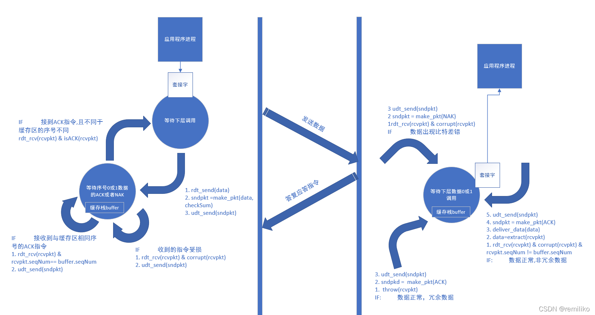
>
> 数据流动情况分析
>
> Sender 端：
>
> - 应用层调用 rdt_send 方法，将数据推送至应用层
>
> - 应用层调用 make_pdt 将数据打包成报文段，并在报文段中封装进一个 校验码，和一个值为 0 或 1 的序号 ，并将其存储至缓存区
> - 应用层调用 udt_send 方法将打包完成的报文段推送至信道
> - Sender 端 此时状态迁移为 等待序号为 0 或 1 的报文段 的 ACK 或 NAK 应答状态
>
> Repetor 端：
>
> - 较低层通过 rdt_rcv 方法，将数据推送到运输层
>
> - 运输层接收到报文段，对报文段数据进行校验处理，校验成功则执行第 4 步，校验失败则执行第 3 步
> - 发送缓存区数据序号的确认 ACK 指令，保持等待下层调用的状态
> - 检测本次数据序号，如果是冗余数据，直接丢弃数据，发送缓存栈中数据序号的 ACK 指令，对于非冗余数据，将数据置换到缓存区之中，并发送一个对本次数据序号的确认 ACK 指令
>
> Sender 端：
>
> - 接收到应答指令后进行数据校验处理，如果数据校验错误，直接重新发送上次数据，如果正确则执行第 2 步
> - 判断接受到的应答指令，如果指令为 ACK 中的序号等于缓存区的序号，执行第 3 步，如果 ACK 指令序号不等于缓存区序号则执行 第 4 步
> - 重新发送上次数据，状态迁移到 等待 ACK 应答指令
> - Sender 端不再阻塞，可以发送新的序号为 1 或者 0 的数据，状态迁移到 等待来自上层调用
>
> ### rdt 协议 3.0
>
> 在处理好了比特差错的问题之后，需要考虑的就是来自底层信道传输的另一个问题，丢包异常（ 即发送方或者接受方由于网络阻塞等状况，并没有收到来自于对方的应答数据，在现实中丢包现象是非常常见的），因此，我们可以加入一个定时器来处理丢包现象，当发送一个报文段的时候，就开启一个定时器，在定时器结束期间，如果没有收到对应数据的应答报文，则重传数据。
>
> 数据流动分析
>
> Sender 端：
>
> - 应用层调用 rdt_send 方法，将数据推送至应用层
>
> - 应用层调用 make_pdt 将数据打包成报文段，并在报文段中封装进一个 校验码，和一个值为 0 或 1 的序号 ，并将其存储至缓存区
> - 应用层调用 udt_send 方法将打包完成的报文段推送至信道，并启动一个定时器事件
> - Sender 端 此时状态迁移为 等待序号为 0 或 1 报文段 的 ACK 应答状态
> - 倘若在定时器等待时间内，没有收到响应，则重新执行第 3 步
>
> Receptor 端：
>
> - 较低层通过 rdt_rcv 方法，将数据推送到运输层
>
> - 运输层接收到报文段，对报文段数据进行校验处理，校验成功则执行第 4 步，校验失败则执行第 3 步
> - 发送缓存区数据序号的确认 ACK 指令, 同时开启一个定时器，保持等待下层调用的状态
> - 检测数据序号，如果是冗余数据，直接丢弃数据，发送缓存区中数据序号的 ACK 指令，对于非冗余数据，将数据置换到缓存区中，发送一个对该数据序号的确认 ACK 指令，同时开启一个定时器
> - 倘若在定时器等待时间内，没有收到响应，则重新执行第 3 或第 4 步
>
> Sender 端
>
> - 接收到应答指令后进行数据校验处理，如果数据校验错误，直接重新发送上次数据，如果正确则执行步第 2 步
> - 判断接受到的应答指令，如果指令为 ACK 中的序号等于缓存区的序号，执行第 3 步，如果 ACK 指令序号不等于缓存区序号则执行 4
> - 重新发送上次数据，状态迁移到 等待 ACK，同时开启一个定时器
> - Sender 端不再阻塞，可以发送新的序号值为 1 或 0 的数据，状态迁移到 等待来自上层调用
> - 倘若在定时器等待时间内，没有收到响应，则重新执行第 3 或第 4 步
>
> ### 总结
>
> 至此，在 rdt 3.0 我们已经得到了一个可靠的数据传输协议，当然它只是一个抽象的雏形，建立于停等协议之上，还需要不少细致的优化，让其更好的切合现实，比如如何脱离停等协议实现更高的传输率，以及拥塞控制等等。文章内的方法为了保证准确性，表达式大多参照于《计算机网络自顶向下方法》书籍中的内容，但是为了简化一下表达，也做出了一点变更。

### Pipelined protocols

Pipelined protocols(管道协议/窗口协议): sender allows multiple, “in-flight”, yet-to-be-acknowledged pkts

- range of sequence numbers must be increased
- buffering at sender and/or receiver

Two generic forms of pipelined protocols: go-Back-N(返回 N 个), selective repeat(选择重传)

Go-back-N(返回 N 个):

- sender can have up to N unACKed packets in pipeline
- receiver only sends cumulative(累计的) ack: doesn’t ack packet if there’s a gap(有缺口的)
- sender has timer for oldest unACKed packet: when timer expires, retransmit all unACKed packets

> [Go-Back-N Protocol | Baeldung on Computer Science](https://www.baeldung.com/cs/networking-go-back-n-protocol)
>
> Go-Back-N and Selective(选择性的) Repeat protocols are fundamental(基本的) sliding window protocols(窗口协议) that help us better understand the key idea behind reliable data transfer in the transport layer of computer networks.
>
> The sliding window (pipelined) protocols achieve utilization(利用) of network bandwidth by not requiring the sender to wait for an acknowledgment before sending another frame.
>
> **In Go-Back-N, the sender controls the flow of packets,** **meaning** **we’ve got a simple and dummy receiver.** Therefore, we’ll start by discussing how the server handles(处理) data packets first.
>
> ### Sender
>
> The sender has a sequence of frames to send. We assume a window size of N. Furthermore, there exist two pointers to keep track of send base (send_base) and the next packet to send (nextseqnum).
>
> 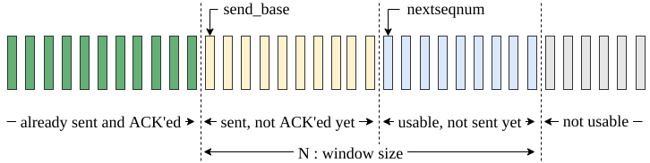
>
> First of all, the sender starts by sending the first frame. Initially, send_base = 0 and nextseqnum = 0. While there are more packets to send and the nextseqnum is smaller than the send_base + N; the sender sends the packet pointed by the nextseqnum pointer and then increments(递增) the nextseqnum.
>
> Meanwhile, the send_base is incremented after receiving acknowledgment packets from the receiver. The reception of duplicate ACK messages does not trigger any mechanism.
>
> There is a single timer for the whole sending window, which measures the timeout for the packet at the send_base. Therefore, if a timeout occurs, the sender restarts the timer and re-transmits all the packets in the sending window starting from send_base.
>
> ### Receiver
>
> The receiver implementation(实施) of the Go-Back-N is as simple as possible:
>
> The receiver only keeps track of the expected sequence number to receive next: nextseqnum.
>
> There is no receiver buffer(缓冲区); out of order packets are simply discarded(丢弃掉). Similarly, corrupted packets are also silently discarded.
>
> It always sends the acknowledgment for the last in-order packet received upon reception of a new packet (successfully or unsuccessfully). As a result, it will generate duplicate acknowledgment messages if something goes wrong.
>
> The Go-Back-N protocol adopts the use of cumulative acknowledgments. That is, receiving acknowledgment for frame n means the frames n-1, n-2, and so on are acknowledged as well. We denote such acknowledgments as ACK n.

Selective Repeat(选择重传):

- sender can have up to N unACKed packets in pipeline
- receiver sends **individual ack** for each packet
- sender maintains timer for each unACKed packet: when timer expires, retransmit only that unACKed packet

> [Selective Repeat Protocol | Baeldung on Computer Science](https://www.baeldung.com/cs/selective-repeat-protocol)
>
> Selective Repeat Protocol (SRP) is a type of [error control protocol](https://en.wikipedia.org/wiki/Error_detection_and_correction) we use in computer networks to ensure the reliable delivery of data packets. Additionally, **we use it in conjunction(结合) with the [Transmission Control Protocol (TCP)](https://www.baeldung.com/cs/udp-vs-tcp) to ensure that the receiver receives data transmitted over the network without errors.**
>
> In the SRP, the sender divides the data into packets and sends them to the receiver. Furthermore(此外), the receiver sends an [acknowledgment (ACK)](https://www.baeldung.com/cs/tcp-protocol-syn-ack) for each packet received successfully. If the sender doesn’t receive an ACK for a particular packet, it retransmits only that packet instead of the entire set of packets.
>
> The SRP uses a window-based(基于窗口的) [flow control mechanism(流量控制机制)](https://www.baeldung.com/cs/tcp-flow-control-vs-congestion-control) to ensure the sender doesn’t overwhelm(充溢，淹没) the receiver with too many packets. Additionally, **the sender and receiver maintain(维持) a window of packets.** Based on the window size, the sender sends packets and waits for a specific amount of time for acknowledgment from the receiver.
>
> The receiver, in turn, maintains a window of packets that contains the frame number(帧编码) it’s receiving from the sender. If a frame is lost during transmission, the receiver sends the sender a negative acknowledgment attacking the frame number.
>
> ### Steps
>
> Now let’s discuss the steps involved in the SRP.
>
> **The first step is to divide data into packets.** The sender divides the data into packets of a fixed size. When the sender divides the data into packets, it assigns **a unique sequence number** to each packet. The numbering of packets plays a crucial role in the SRP.
>
> The next step is to send the packets to the receiver. The receiver receives the packets and sends an acknowledgment(ACK) for each packet received successfully.
>
> The sender and receiver maintain a window of packets indicating(指示) the number of frames we can transmit or receive at a given time. Additionally, we determine the size of the window based on the network conditions. As the sender sends packets, it updates its window to reflect(反映) the packets that have been transmitted, and the ACKs received.
>
> However, if the sender doesn’t receive an ACK for a particular(特指的) packet within a certain timeout period, it retransmits(重传) only that packet instead of the entire set of packets. The receiver only accepts packets that are within its window. If the receiver receives a packet outside the window, it discards(丢弃) the packet.
>
> **The receiver sends selective acknowledgments (SACKs) for packets received out of order or lost.** The sender processes the SACKs to determine which packets need to be retransmitted.
>
> Finally, we continue this process until we successfully send the data packets or the number of retransmissions exceeds(超过) a predetermined threshold(预定阈值).

## Connection-oriented transport: TCP

### TCP: Overview

- **point-to-point(端对端)**: one sender, one receiver

- **reliable, in-order byte steam(可靠的传输)**: no “message boundaries”(消息边界)

- **pipelined(最大阈值控制)**: TCP congestion and flow control set window size

- **full duplex data(全双工数据)**:

  - bi-directional data flow(双向数据流) in same connection

  - MSS: maximum segment size(最大分段大小)

- **connection-oriented(以连接为导向)**: handshaking (exchange of control msgs) inits sender, receiver state before data exchange
- **flow controlled(流量控制)**: sender will not overwhelm receiver

### TCP segment structure

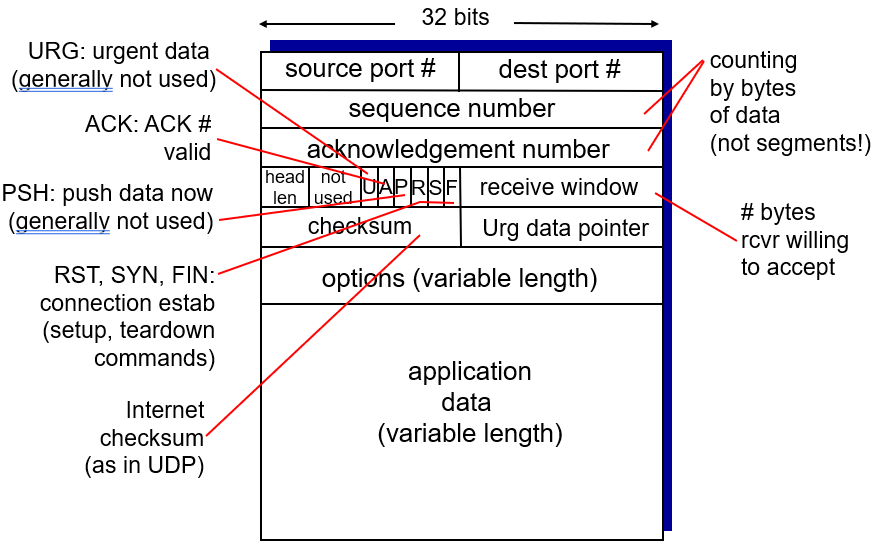

> ### Packet format
>
> When sending packets using TCP/IP, the data portion of each [IP packet](https://www.khanacademy.org/a/ip-packets) is formatted as a **TCP segment(TCP 段)**.
>
> 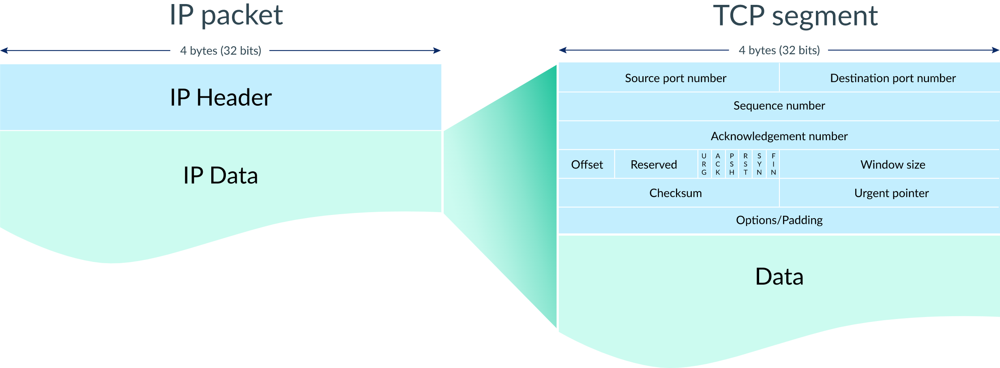
>
> Each TCP segment contains a header and data. The TCP header contains many more fields than the UDP header and can range in size from 202020 to 606060 bytes, depending on the size of the options field(选项字段大小).
>
> The TCP header shares some fields with the UDP header: source port number, destination port number, and checksum. To remember how those are used, review the [UDP article](https://www.khanacademy.org/a/user-datagram-protocol-udp).
>
> ### From start to finish
>
> Let's step through the process of transmitting a packet with TCP/IP.
>
> #### Step 1: Establish connection(建立连接)
>
> When two computers want to send data to each other over TCP, they first need to establish(建立) a connection using a **three-way handshake(3 次握手)**.
>
> 
>
> The first computer sends a packet with the SYN bit set to 111 (SYN = "synchronize?"). The second computer sends back a packet with the ACK bit set to 111 (ACK = "acknowledge!") plus the SYN bit set to 111. The first computer replies back with an ACK.
>
> The SYN and ACK bits are both part of the TCP header:
>
> .png)
>
> In fact, the three packets involved in the three-way handshake do not typically(通常) include any data. Once the computers are done with the handshake, they're ready to receive packets containing actual data(包含实际数据).
>
> #### Step 2: Send packets of data
>
> When a packet of data is sent over TCP, the recipient(收件人) must always acknowledge what they received.
>
> .png)
>
> The first computer sends a packet with data and a sequence number. The second computer acknowledges it by setting the ACK bit and increasing the acknowledgement number by the length of the received data.
>
> The sequence and acknowledgement numbers are part of the TCP header:
>
> .png)
>
> Those two numbers help the computers to keep track of which data was successfully received, which data was lost, and which data was accidentally(意外地) sent twice.
>
> #### Step 3: Close the connection
>
> Either(任意一台) computer can close the connection when they no longer want to send or receive data.
>
> .png)
>
> A computer initiates closing the connection by sending a packet with the FIN bit set to 1 (FIN = finish). The other computer replies with an ACK and another FIN. After one more ACK from the initiating computer, the connection is closed.
>
> ### Detecting lost packets
>
> TCP connections can detect lost packets using a timeout.
>
> .png)
>
> After sending off a packet, the sender starts a timer and puts the packet in a retransmission queue(传输队列). If the timer runs out and the sender has not yet received an ACK from the recipient, it sends the packet again.
>
> The retransmission may lead to the recipient receiving duplicate packets, if a packet was not actually lost but just very slow to arrive or be acknowledged. If so, the recipient can simply discard(丢弃) duplicate packets. It's better to have the data twice than not at all!
>
> ### Handling out of order packets
>
> TCP connections can detect out of order(乱序) packets by using the sequence(序列) and acknowledgement numbers.
>
> .png)
>
> When the recipient sees a higher sequence number than what they have acknowledged so far, they know that they are missing at least one packet in between. In the situation pictured above, the recipient sees a sequence number of #73 but expected a sequence number of #37. The recipient lets the sender know there's something amiss(错误，有什么不对劲) by sending a packet with an acknowledgement number set to the expected sequence number.
>
> Sometimes the missing packet is simply taking a slower route through the Internet and it arrives soon after.
>
> .png)
>
> Other times, the missing packet may actually be a lost packet and the sender must retransmit the packet.
>
> .png)
>
> In both situations, the recipient has to deal with out of order packets. Fortunately, the recipient can use the sequence numbers to reassemble(重新组装) the packet data in the correct order.
>
> .png)
