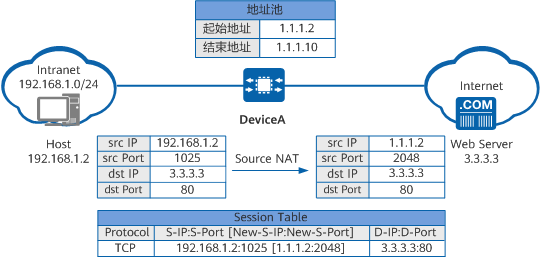

## Outline

1. Overview of Network layer
   - data plane
   - control plane
2. What’s inside a router
3. IP: Internet Protocol
   - datagram format
   - fragmentation
   - IPv4 addressing
   - network address translation
   - IPv6
4. Generalized Forward and SDN
   - match
   - action
   - OpenFlow: examples of match-plus-action in action

## Overview of Network layer

> 部分内容摘自 [【计算机网络-自顶向下】4—Network Layer: Data Plane 网络层：数据平面（概述、路由器工作原理、IPv4、DHCP、IPv6）\_一棵\_\_\_大树的博客-CSDN 博客](https://blog.csdn.net/weixin_53580595/article/details/129480116)，有删改。

- transport segment(片段) from sending to receiving host
- on sending side encapsulates(封装) segments into datagrams(数据报；数据包)
- on receiving side, delivers(传送) segments to transport layer(传输层)
- network layer protocols(协议) in every host(主机), router
- router examines(检查) header fields in all IP datagrams passing through it

互联网采用的设计思路是这样的：网络层向上只提供简单灵活的、无连接的、尽最大努力交付的数据报服务。

Two key network-layer functions:

- forwarding 转发: move packets from router’s input to appropriate(适当的) router output
- routing 路由: determine(确定) route taken by packets from source to destination (using routing algorithms 路由算法)

> - **转发（forwarding）——数据平面（data plane）**：将分组从一个输入链路接口转移到适当的输出链路接口的路由器的本地动作（主要利用硬件）；
> - **路由选择（routing）——控制平面（control plane）**：确定分组从源到目的地所采取的端到端路径的网络范围处理过程（主要利用软件）。

### Data plane & control plane

> [什么是控制平面？| 控制平面与数据平面 | Cloudflare](https://www.cloudflare.com/zh-cn/learning/network-layer/what-is-the-control-plane/)
>
> 什么是网络中的“平面”？
>
> 在网络中，*平面*是特定过程发生位置的抽象概念。该术语是在“存在平面”的意义上使用的。网络中最常引用的两个平面是控制平面和数据平面（也称为转发平面）。
>
> ### 什么是控制平面？
>
> 控制平面（Control plane）是网络中控制数据[包](https://www.cloudflare.com/learning/network-layer/what-is-a-packet/)转发方式的部分——即数据如何从一个地方发送到另一个地方。例如，创建[路由](https://www.cloudflare.com/learning/network-layer/what-is-routing/)表的过程被认为是控制平面的一部分。路由器使用各种[协议](https://www.cloudflare.com/learning/network-layer/what-is-a-protocol/)来识别网络路径，并将这些路径存储在路由表中。
>
> ### 什么是数据平面/转发平面？
>
> 与决定如何转发数据包的控制平面相反，数据平面（Data plane）会实际转发数据包。数据平面也称为转发平面。
>
> 打个比方，控制平面是在城市道路交叉口工作的交通信号灯。数据平面（或转发平面）则更像是在道路上行驶、在路口停下并遵守交通信号灯的汽车。

two control-plane approaches:

- traditional routing algorithms(传统路由算法): implemented(执行) in routers
- software-defined networking (SDN，软件定义网络): implemented in (remote) servers

> 每台网络路由器中有一个关键元素是它的转发表（forwarding table）。路由器检查到达分组头部的一个或多个字段值，进而使用这些头部值在其转发表中索引，通过这种方法来转发分组。
>
> 两种控制平面方法：
>
> - **传统方法**是由路由器器中的路由选择算法决定转发表中的值：
>
>   
>
> - **软件定义网络（Software-Defined Networking，SDN）方法**是从路由器物理上分离的另一种方法，远程控制器计算和分发转发表以供每台路由器所使用：
>
>   

### Network service model

ATM 是 "Asynchronous Transfer Mode" 的缩写，意为“异步传输模式”。它是一种网络通信技术，在计算机网络中被广泛使用。ATM 网络通过将数据划分为固定大小的单元（称为“单元”或“细胞”）来传输数据，这些单元具有相同的长度，并可以在网络中以任何顺序传输。

ATM 技术最初被设计用于广域网和局域网之间的高速数据传输，但由于其高效性和可靠性，也被应用于语音、视频和图像等多媒体数据的传输。

> **网络服务模型（network service model）**定义了分组在发送与接收端系统之间的端到端运输特性。可能提供服务：
>
> - 确保交付；
> - 具有时延上界的确保交付；
> - 有序分组交付；
> - 确保最小带宽；
> - 安全性。

## What’s inside a router

### Router architecture overview

路由器体系结构概述

注：上半为路由、管理控制平面（软件），下半为在转发数据平面（硬件）

### Input port functions

左侧输入端：

> 输入端口（input port）：
>
> - 在路由器中终结进入物理链路的物理层；
> - 与位于入链路远端的数据链路层交互；
> - 查找转发表决定路由器的输出端口；
> - 控制分组从输入端口转发到路由选择处理器

decentralized switching(分散式交换):

- _destination-based forwarding(基于目标的转发):_ forward based only on destination IP address (traditional)

- _generalized forwarding(通用转发):_ forward based on any set of header field values

### Longest prefix matching

最长前缀匹配

When looking for forwarding table entry(转发表条目) for given destination address, use longest address prefix(前缀) that matches destination address.

| Destination Address Range                        | Link interface |
| ------------------------------------------------ | -------------- |
| 11001000 00010111 00010\*\*\* \*\*\*\*\*\*\*\*\* | 0              |
| 11001000 00010111 00011000 \*\*\*\*\*\*\*\*\*    | 1              |
| 11001000 00010111 00011\*\*\* \*\*\*\*\*\*\*\*\* | 2              |
| otherwise                                        | 3              |

examples:

- DA: 11001000 00010111 00010110 10100001 means interface 0
- DA: 11001000 00010111 00011000 10101010 means interface 1

### Switching fabrics

switch fabric(交换结构): transfer packet from input buffer to appropriate output buffer 将数据包从输入缓冲区传输到适当的输出缓冲区

switching rate(交换速率): rate at which packets can be transfer from inputs to outputs 数据包从输入传输到输出的速率

three types of switching fabrics(交换结构):

- Switching via memory(内存)

  first generation routers:

  - traditional computers with switching under direct control of CPU 在 CPU 直接控制下进行交换的传统计算机
  - packet copied to system’s memory
  - speed limited by memory bandwidth

- Switching via a bus(总线)

  - _bus contention(总线争夺):_ switching speed limited by bus bandwidth 交换速度受总线带宽限制

- Switching via interconnection network(互联网)

  是一种计算机网络中的通信方式，它使用一组相互连接的节点来传递数据。这些节点可以被看作是一个多端口的交换机，其中每个端口都与一个设备或者另一个节点相连。当一个节点想要发送数据时，它会将数据包发送到目标节点所在的端口，并且经过多次路由选择和转发，在互联网络中到达目的地。这种通信方式广泛应用于高性能计算、数据中心网络和分布式系统等领域。

### Input port queuing 输入端口排队

- fabric(结构) slower than input ports combined → queueing(排队) may occur(出现) at input queues

- Head-of-the-Line(HOL) blocking(线头阻塞): queued datagram at front of queue prevents others in queue from moving forward 队列前面排队的 datagram 可防止队列中的其他人向前移动

### Output ports

> 输出端口（output port）：
>
> - 存储从交换结构接收的分组；
> - 执行必要的链路层和物理层功能在输出链路上传输这些分组。

- _buffering_ required when datagrams arrive from fabric faster than the transmission rate 当数据报从结构到达的速度快于传输速率时需要缓冲
- _scheduling discipline_ chooses among queued datagrams for transmission 调度规则在排队的数据报中选择传输

### Scheduling mechanisms

_scheduling(调度):_ choose next packet to send on link

_FIFO (first in first out, 先进先出) scheduling:_ send in order of arrival to queue

> ### 先进先出（First-In-First-Out，FIFO）
>
> 运行中的 FIFO 队列如下图所示：
>
> 
>
> ### 优先权排队（priority queuing）
>
> 假设分组 1、3 和 4 是高优先权，分组 2 和 5 是低优先权，在**非抢占式优先权排队（non-preemptive priority queuing）** 中，运行如下图所示：
>
> 
>
> ### 循环排队规则（round robin queuing discipline）
>
> 假设分组 1，2 和 4 属于第一类，分组 3 和 5 属于第二类，运行如下图所示：
>
> 

## IP: Internet Protocol

::: tip
协议包括：语义、语法、时序。
:::

### Datagram format

IPv4 Datagram Format

> IPv4 数据报格式如下图所示：
>
> 
>
> - **版本号（Version）**：规定了数据报的 IP 协议版本；
> - **头部长度（Header length）**：在无选项（Options）头部占据 20 字节；
> - **服务类型（Type of service）**：不同类型的数据报可以相互区分；
> - **数据报长度（Datagram length）**：IP 数据报的总长度（头部加上数据），以字节计数；
> - **标识（Identifier）、标志（Flags）、片漂移（Fragmentation offset）**：用于 IP 分片；
> - **寿命（Time-to-live，TTL）**：确保数据段不会永远在网络中循环；
> - **上层协议（Upper-layer protocol）**：指示 IP 数据报应交付给哪个运输层协议；
> - **头部校验（Header checksum）**：帮助路由器检测收到的 IP 数据报中的比特错误；
> - **源和目的 IP 地址（Source and Destination IP address）**；
> - **选项（Options）**：允许 IP 头部被扩展；
> - **数据（Data）**：一般为运输层报文段。

:::tip how much overhead?

$$
(\text{20 bytes of TCP + 20 bytes of IP} = \text{40 bytes}) + \text{app layer overhead}
$$

:::

### Fragmentation

IP fragmentation, reassembly IP 分段与重组

一个链路层帧能承载的最大数据量叫作最大传送单元（Maximum Transmission Unit，MTU）。

large IP datagram divided (“fragmented”, 分段) within net:

- one datagram becomes several datagrams

- “reassembled”(重组) only at final destination

- IP header bits used to identify(识别), order related fragments(重排分段)

### IPv4 addressing

IPv4 编址：主机与物理链路之间的边界叫做接口（interface）。每个 IP 地址长度为 32 比特（4 字节），因此总共有 $2^{32}$ 个可能的 IP 地址。这些地址通常按所谓点分十进制记法（dotted-decimal notation）书写，及地址中的每个字节用它的十进制形式书写，各字节以句点隔开。

如：地址`192.32.216.9`的二进制记法是`11000001 00100000 11011000 00001001`。

*interface:* connection between host/router and physical link(物理连接)

#### Subnets

下图中，一台路由器（具有三个接口）用于互联7台主机。

图中左上侧的3个主机和它们连接的路由器接口，都有一个形如233.1.1.xxx的IP地址。用IP的术语说，互联这3个主机接口与1个互联网接口的网络形成一个子网（subnet）。IP编址为这个子网分配一个地址233.1.1.0/24，其中/24记法，有时称为子网掩码（network mask），指示32比特中的最左侧24比特定义了子网地址。

#### IP addressing: CIDR

下图是由3个路由器互联的6个子网：

因特网的地址分配策略被称为无类别域间路由选择（Classless Interdomain Routing，CIDR）。当使用子网寻址时，32比特的IP地址被划分为两部分，并且也具有点分十进制形式a.b.c.d/x，其中x指示了地址的第一部分中的比特数，并且该部分经常被称为该地址的前缀（prefix）（或网络前缀）。

::: tip How does a *host* get IP address?

hard-coded by system admin in a file:

- Windows: control-panel->network->configuration->tcp/ip->properties
- UNIX: /etc/rc.config

:::

::: tip
IP广播地址255.255.255.255：当主机发出以广播地址为目的地址的数据报时，该报文会交付给同一个网络中的所有主机。
:::

#### 获取主机地址（DHCP）

主机地址的配置更多的是使用**动态主机配置协议（Dynamic Host Configuration Protocol，DHCP）**。

*goal:* allow host to *dynamically(动态)* obtain its IP address from network server when it joins network

- 给定主机每次与网络连接时能得到一个相同的IP地址；
- 给某个主机分配一个临时的IP地址（temporary IP address），每次地址可能不同；
- 允许移动设备频繁的加入和离开网络。

DHCP客户和服务器分布如下图：

DHCP协议是一个4个步骤过程，`yiaddr`指示分配给该新到达用户的地址，如下图所示：

DHCP can return more than just allocated(分配) IP address on subnet:

- address of first-hop router(第一跳路由地址) for client
- name and IP address of DNS sever
- network mask(网络掩码) (indicating network versus host portion of address 指示地址的网络与主机部分)

> [什么是DHCP？为什么要用DHCP？ - 华为 (huawei.com)](https://info.support.huawei.com/info-finder/encyclopedia/zh/DHCP.html)
>
> ### 什么是DHCP？
>
> 动态主机配置协议DHCP（Dynamic Host Configuration Protocol）是一种网络管理协议，用于集中对用户IP地址进行动态管理和配置。
>
> DHCP于1993年10月成为标准协议，其前身是BOOTP协议。DHCP协议由RFC 2131定义，采用客户端/服务器通信模式，由客户端（DHCP Client）向服务器（DHCP Server）提出配置申请，DHCP Server为网络上的每个设备动态分配IP地址、子网掩码、默认网关地址，域名服务器（DNS）地址和其他相关配置参数，以便可以与其他IP网络通信。
>
> ### 为什么要使用DHCP？
>
> 在IP网络中，每个连接Internet的设备都需要分配唯一的IP地址。DHCP使网络管理员能从中心结点监控和分配IP地址。当某台计算机移到网络中的其它位置时，能自动收到新的IP地址。DHCP实现的自动化分配IP地址不仅降低了配置和部署设备的时间，同时也降低了发生配置错误的可能性。另外DHCP服务器可以管理多个网段的配置信息，当某个网段的配置发生变化时，管理员只需要更新DHCP服务器上的相关配置即可，实现了集中化管理。
>
> 总体来看，DHCP带来了如下优势：
>
> - 准确的IP配置：IP地址配置参数必须准确，并且在处理“ 192.168.XXX.XXX”之类的输入时，很容易出错。另外印刷错误通常很难解决，使用DHCP服务器可以最大程度地降低这种风险。
> - 减少IP地址冲突：每个连接的设备都必须有一个IP地址。但是，每个地址只能使用一次，重复的地址将导致无法连接一个或两个设备的冲突。当手动分配地址时，尤其是在存在大量仅定期连接的端点（例如移动设备）时，可能会发生这种情况。DHCP的使用可确保每个地址仅使用一次。
> - IP地址管理的自动化：如果没有DHCP，网络管理员将需要手动分配和撤消地址。跟踪哪个设备具有什么地址可能是徒劳的，因为几乎无法理解设备何时需要访问网络以及何时需要离开网络。DHCP允许将其自动化和集中化，因此网络专业人员可以从一个位置管理所有位置。
> - 高效的变更管理：DHCP的使用使更改地址，范围或端点变得非常简单。例如，组织可能希望将其IP寻址方案从一个范围更改为另一个范围。DHCP服务器配置有新信息，该信息将传播到新端点。同样，如果升级并更换了网络设备，则不需要网络配置。
>
> ### DHCP是怎么工作的？
>
> DHCP协议采用UDP作为传输协议，DHCP客户端发送请求消息到DHCP服务器的68号端口，DHCP服务器回应应答消息给DHCP客户端的67号端口。
>
> 只有跟DHCP客户端在同一个网段的DHCP服务器才能收到DHCP客户端广播的DHCP DISCOVER报文。当DHCP客户端与DHCP服务器不在同一个网段时，必须部署DHCP中继来转发DHCP客户端和DHCP服务器之间的DHCP报文。在DHCP客户端看来，DHCP中继就像DHCP服务器；在DHCP服务器看来，DHCP中继就像DHCP客户端。
>
> **无中继场景时DHCP客户端首次接入网络的工作原理**
>
> 如下图所示，在没有部署DHCP中继的场景下，首次接入网络DHCP客户端与DHCP服务器的报文交互过程，该过程称为DHCP报文四步交互。
>
> 
>
> **有中继场景时DHCP客户端首次接入网络的工作原理**
>
> 有DHCP中继的场景中，首次接入网络的DHCP客户端和DHCP服务器的工作原理与**无中继场景时DHCP客户端首次接入网络的工作原理**相同。主要差异是DHCP中继在DHCP服务器和DHCP客户端之间转发DHCP报文，以保证DHCP服务器和DHCP客户端可以正常交互。下面仅针对DHCP中继的工作原理进行介绍。
>
> 如下图所示，在部署DHCP中继的场景下，首次接入网络DHCP客户端与DHCP服务器的报文交互过程。
>
> 
>
> **DHCP客户端重用曾经使用过的地址的工作原理**
>
> DHCP客户端非首次接入网络时，可以重用曾经使用过的地址。如下图所示，DHCP客户端与DHCP服务器交互DHCP报文，以重新获取之前使用的IP地址等网络参数，该过程称为两步交互。
>
> 
>
> **DHCP客户端更新租期的工作原理**
>
> DHCP服务器采用动态分配机制给客户端分配IP地址时，分配出去的IP地址有租期限制。DHCP客户端向服务器申请地址时可以携带期望租期，服务器在分配租期时把客户端期望租期和地址池中租期配置比较，分配其中一个较短的租期给客户端。租期到期或者客户端下线释放地址后，服务器会收回该IP地址，收回的IP地址可以继续分配给其他客户端使用。这种机制可以提高IP地址的利用率，避免客户端下线后IP地址继续被占用。如果DHCP客户端希望继续使用该地址，需要更新IP地址的租期（如延长IP地址租期）。
>
> DHCP客户端更新租期的过程如下图所示。
>
> 
>
> 如下图所示，部署DHCP中继时，更新租期的过程与上述过程相似。
>
> 
>
> ### DHCP使用场景
>
> DHCP提供了两种地址分配机制，网络管理员可以根据网络需求为不同的主机选择不同的分配策略。
>
> - 动态分配机制：通过DHCP为主机分配一个有使用期限的IP地址。
>
>   DHCP使用了租期的概念，或称为设备IP地址的有效期。租用时间是不定的，主要取决于用户在某地连接Internet需要多久，这种分配机制适用于主机需要临时接入网络或者空闲地址数小于网络主机总数且主机不需要永久连接网络的场景。
>
> - 静态分配机制：网络管理员通过DHCP为指定的主机分配固定的IP地址。
>
>   相比手工静态配置IP地址，通过DHCP方式静态分配机制避免人工配置发生错误，方便管理员统一维护管理。

> 建议阅读：[动态主机配置协议 (DHCP) | Microsoft Learn](https://learn.microsoft.com/zh-cn/windows-server/networking/technologies/dhcp/dhcp-top)

### network address translation

**网络地址转换（Network Address Translation，NAT）**：就外界而言，本地网络中的所有设备只共享一个IPv4地址。

NAT具体步骤如下图：

> [什么是NAT？NAT的类型有哪些？ - 华为 (huawei.com)](https://info.support.huawei.com/info-finder/encyclopedia/zh/NAT.html)
>
> ### 什么是NAT？
>
> NAT是一种地址转换技术，它可以将IP数据报文头中的IP地址转换为另一个IP地址，并通过转换端口号达到地址重用的目的。NAT作为一种缓解IPv4公网地址枯竭的过渡技术，由于实现简单，得到了广泛应用。
>
> ### NAT解决了什么问题？
>
> 随着网络应用的增多，IPv4地址枯竭的问题越来越严重。尽管[IPv6](https://info.support.huawei.com/info-finder/encyclopedia/zh/IPv6.html)可以从根本上解决IPv4地址空间不足问题，但目前众多网络设备和网络应用大多是基于IPv4的，因此在IPv6广泛应用之前，使用一些过渡技术（如CIDR、私网地址等）是解决这个问题的主要方式，NAT就是这众多过渡技术中的一种。
>
> 当私网用户访问公网的报文到达网关设备后，如果网关设备上部署了NAT功能，设备会将收到的IP数据报文头中的IP地址转换为另一个IP地址，端口号转换为另一个端口号之后转发给公网。在这个过程中，设备可以用同一个公网地址来转换多个私网用户发过来的报文，并通过端口号来区分不同的私网用户，从而达到地址复用的目的。
>
> 早期的NAT是指Basic NAT，Basic NAT在技术上实现比较简单，只支持地址转换，不支持端口转换。因此，Basic NAT只能解决私网主机访问公网问题，无法解决IPv4地址短缺问题。后期的NAT主要是指网络地址端口转换NAPT（Network Address Port Translation），NAPT既支持地址转换也支持端口转换，允许多台私网主机共享一个公网IP地址访问公网，因此NAPT才可以真正改善IP地址短缺问题。
>
> ### NAT的类型
>
> 根据NAT转换是对报文中的源地址进行转换还是对目的地址进行转换，NAT可以分为源NAT、目的NAT和双向NAT，下面我们分别介绍这三种NAT类型。
>
> #### 源NAT
>
> 源NAT在NAT转换时，仅对报文中的源地址进行转换，主要应用于私网用户访问公网的场景。当私网用户主机访问Internet时，私网用户主机发送的报文到达NAT设备后，设备通过源NAT技术将报文中的私网IPv4地址转换成公网IPv4地址，从而使私网用户可以正常访问Internet。
>
> #### 目的NAT
>
> 目的NAT在NAT转换时，仅对报文中的目的地址和目的端口号进行转换，主要应用于公网用户访问私网服务的场景。当公网用户主机发送的报文到达NAT设备后，设备通过目的NAT技术将报文中的公网IPv4地址转换成私网IPv4地址，从而使公网用户可以使用公网地址访问私网服务。
>
> #### 双向NAT
>
> 双向NAT指的是在转换过程中同时转换报文的源信息和目的信息。双向NAT不是一个单独的功能，而是源NAT和目的NAT的组合。双向NAT是针对同一条流，在其经过设备时同时转换报文的源地址和目的地址。双向NAT主要应用在同时有外网用户访问内部服务器和私网用户访问内部服务器的场景。
>
> ### NAT是如何工作的？
>
> 根据前面的分类，我们分别从源NAT和目的NAT中各选一种NAT为代表，介绍其工作原理。其他类型的NAT虽然在转换时，转换的内容有细微差别，但是工作原理都相似，不再重复介绍。此外，双向NAT是源NAT和目的NAT的组合，双向NAT的工作原理也不再重复介绍。
>
> #### NAPT工作原理
>
> NAPT在进行地址转换的同时还进行端口转换，可以实现多个私网用户共同使用一个公网IP地址上网。NAPT根据端口来区分不同用户，真正做到了地址复用。
>
> 
>
> 1. 设备收到Host发送的报文后查找NAT策略，发现需要对报文进行地址转换。
> 2. 设备根据源IP Hash算法从NAT地址池中选择一个公网IP地址，替换报文的源IP地址，同时使用新的端口号替换报文的源端口号，并建立会话表，然后将报文发送至Internet。
> 3. 设备收到Web Server响应Host的报文后，通过查找会话表匹配到步骤2中建立的表项，将报文的目的地址替换为Host的IP地址，将报文的目的端口号替换为原始的端口号，然后将报文发送至Intranet。

### IPv6

产生动机：

- 将完全分配32位IPv4地址空间；
- 速度处理/转发：40字节固定长度首部；
- 启用流标签的不同网络层处理。

报文格式：

- *priority(优先级):* identify priority among datagrams in flow
- *flow Label(流标签):* identify datagrams in same “flow.” (concept of“flow” not well defined “流”的概念没有很好地定义).
- *next header(下一个标头):* identify upper layer protocol(上层协议) for data 

Other changes from IPv4:

- checksum: removed entirely to reduce processing time at each hop(每个越点)
- options: allowed,  but outside of header(标头之外), indicated(指示) by “Next Header” field
- ICMPv6: new version of ICMP
- additional message types, e.g. “Packet Too Big”
- multicast group management functions