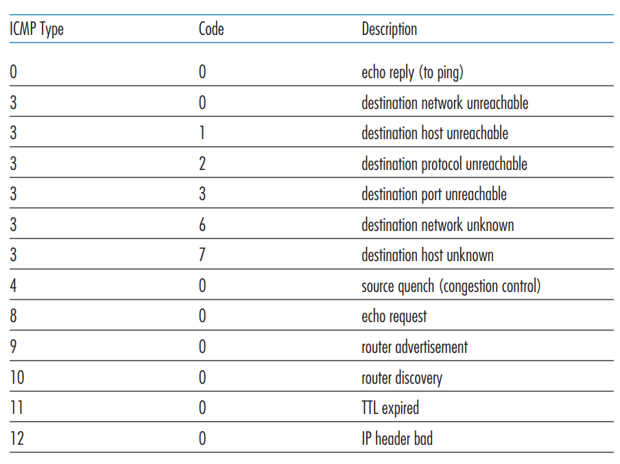

## Outline

1. introduction
2. routing protocols
3. intra-AS routing in the Internet: OSPF
4. routing among the ISPs: BGP
5. The SDN control plane
   - link state
   - distance vector
6. ICMP: The Internet Control Message Protocol
7. Network management and SNMP

> 部分内容参考自 [【计算机网络-自顶向下】5—Network Layer:Control Plane 网络层：控制平面（概述、路由选择算法、OSPF、BGP、SDN、ICMP、SNMP）\_一棵\_\_\_大树的博客-CSDN 博客](https://blog.csdn.net/weixin_53580595/article/details/129482346)，有删改。

## Introduction

- **每个路由器控制（Per-router control）**：每台路由器有一个路由选择组件，用于与其他路由器中的路由选择组件通信，以计算其转发表的值。如下图所示：

  

- **逻辑集中式控制（Logically centralized control）**：逻辑集中式控制器计算并分发转发表以供每台路由器使用，如下图所示：

  

## Routing protocols

_goal:_ determine(确定) “good” paths (equivalently, routes 等效于路由器), from sending hosts to receiving host, through network of routers

### Introduction of Routing protocols

#### Graph abstraction of the network


其中：

- graph: $G = (N,E)$

- $N = \text{set of routers} = { u, v, w, x, y, z }$
- $E = \text{set of links} = \{ (u,v), (u,x), (v,x), (v,w), (x,w), (x,y), (w,y), (w,z), (y,z) \}$
- $c(x,x’) = \text{cost of link}\ (x,x’)$

  e.g., $c(w,z) = 5$

#### Routing algorithm

即路由选择算法。

分类上，从 global or decentralized information:

- _global:_ all routers have complete topology, link cost info 都有完整的拓扑结构，链路成本信息

- _decentralized:_ router knows physically-connected neighbors, link costs to neighbors 路由器知道物理连接的邻居，与邻居的链路成本

  iterative process of computation, exchange of info with neighbors 计算的迭代过程，与邻居交换信息

从 static or dynamic:

- _static_: routes change slowly over time

- _dynamic_: routes change more quickly

  periodic update 定期更新
  in response to link cost changes 响应链接成本总是保持变化的

算法上：

- 集中式路由选择算法（centralized routing algorithm）：用完整、全局性的网络知识计算出从源到目的地之间的最低开销路径。具有全局状态信息的算法常被称作链路状态（Link State，LS）算法，因为该算法必须知道网络中每条链路的开销。
- 分散式路由选择算法（decentralized routing algorithm）：路由器以迭代、分布式计算的方式计算出最低开销路径。没有节点拥有关于网络链路开销的完整信息。一个分散式路由选择算法为距离向量（Distance-Vector，DV）算法，每个节点维护到网络中所有其他节点的开销估计的向量。

### Link state

在实践中，这经常由链路状态广播（link state broadcast）算法完成。下面给出的链路状态路由选择算法叫做 Dijkstra 算法，其计算从某节点（源节点 u）到网络中所有其他节点的最低开销路径。

基本思想：经算法的第 k 次迭代后，可知道到 k 个目的节点的最低开销路径，在到所有目的节点的最低开销路径之中，这 k 条路径具有 k 个最低开销。

我们定义如下符号：

- `D(v)`：到算法的本次迭代，从源节点到目的节点 v 的最低开销；
- `p(v)`：从源到 v 沿着当前最小开销路径的前一个节点（v 的邻居）；
- `N'`：节点子集；如果从源到 v 的最低开销路径已经确定，v 在`N'`中。

源节点 u 的链路状态（LS）算法如下：

```python
# Initialization:
N' = {u}
for all nodes v
if v adjacent to u
    then D(v) = c(u,v)
else D(v) = ∞

# Loop
find w not in N' such that D(w) is a minimum
add w to N'
update D(v) for all v adjacent to w and not in N' :
    D(v) = min( D(v), D(w) + c(w,v) )
/* new cost to v is either old cost to v or known
shortest path cost to w plus cost from w to v */
# until all nodes in N'
```

对于下图的网络，链路状态算法迭代运行如下：


| Step | N'     | D(v),p(v) | D(w),p(w) | D(x),p(x) | D(y),p(y) | D(z),p(z) |
| ---- | ------ | --------- | --------- | --------- | --------- | --------- |
| 0    | u      | 2,u       | 5,u       | 1,u       | ∞         | ∞         |
| 1    | ux     | 2,u       | 4,x       |           | 2,x       | ∞         |
| 2    | uxy    | 2,u       | 3,y       |           |           | 4,y       |
| 3    | uxyv   |           | 3,y       |           |           | 4,y       |
| 4    | uxyvw  |           |           |           |           | 4,y       |
| 5    | uxyvwz |           |           |           |           |           |

路线上的流量变化和拥塞会使 LS 算法产生 **路由震荡（Routing Oscillations）**。

### Distance vector

距离向量（Distance-Vector，DV）算法是一种迭代的（iterative）、异步的（asynchronous）、分布式的（distributed）和自我终止的（self-termination）。

::: tip
这种方法没有组建图，只通过方程不断迭代更新数据，收集了与邻居之间的信息。
:::

令 $d_x(y)$ 是从节点 x 到节点 y 的最低开销路径。则该最低开销与著名的 Bellman-Ford 方程相关，即：

$$
d_x(y)=\min_v{c(x,v)+d_v(y)}
$$

方程中的 $\min_v$ 是对于 x 的所有邻居的。

算法基本思想：每个节点 x 以 $D_x(y)$ 开始，对在 N 中的所有节点 y，估计从 x 到 y 的最低开销路径的开销路径。

DV 算法具体实例如下：


#### 链路开销改变与链路故障

链路开销发生改变：

- node detects local link cost change 节点检测本地链路成本变化
- updates routing info, recalculates distance vector 重新计算距离矢量
- if DV changes, notify neighbors

有时当链路中有一条路的距离极长甚至接近于开路，这时我们会遇到**路由选择环路（routing loop）**，这样的问题也被称为**无穷计数（count-to-infinity）**问题。

#### 距离向量算法：增加毒性逆转

毒性逆转（poisoned reverse），思想：如果 z 通过 y 路由选择目的地 x，则 z 将通告 y，它到 x 的距离是无穷大，也就是 z 将通告：

$$
D_z(x)=\infin
$$

但毒性逆转并不能解决一般的无穷计数问题。

### Comparison of LS and DV algorithms

message complexity 消息复杂性:

- LS: with n nodes, E links, $O(nE)$ msgs sent

- DV: exchange between neighbors only

  convergence time varies 收敛时间不同

speed of convergence 收敛速度:

- LS: $O(n^2)$ algorithm requires $O(nE)$ msgs

  may have oscillations 可能有震荡

- DV: convergence time varies

  may be routing loops 可能是路由环路

  count-to-infinity problem 计数无穷大问题

::: tip robustness: what happens if router malfunctions?

稳健性：如果路由器出现故障会怎样？

LS:

- node can advertise incorrect link cost 节点可以通告不正确的链接成本
- each node computes only its own table 每个节点仅计算自己的表

DV:

- DV node can advertise incorrect path cost DV 节点可以通告不正确的路径成本
- each node’s table used by others 其他节点使用的每个节点的表
- error propagate thru network 错误也会通过网络传播

:::

## Intra-AS routing in the Internet: OSPF

因特网中自治系统内部的路由选择：OSPF（开放最短路优先 Open Shortest Path First）

随着路由器规模增大和管理自治的要求，可以通过将路由器组织进自治系统（Autonomous System，AS）来解决。在一个自治系统内运行的路由算法叫做自治系统内部路由选择协议（intra-autonomous system routing protocol）。

::: tip 市面上的常见路由协议

基于 DV:

- RIP

- IGRP

- EIGRP

基于 LS:

- OSPF（主流）

- IS-IS

:::

OSPF 是一种链路状态协议，它使用洪泛链路状态信息和 Dijkstra 最低开销路径算法。使用 OSPF，一台路由器构建了一幅关于整个自治系统的完整拓扑图。于是，每台路由器在本地运行 Dijkstra 的最短路径算法，以确定一个自身为根节点到所有子网的最短路径树。

使用 OSPF 时，路由器向自治系统内所有其他路由器广播路由选择信息，而不仅仅是向其相邻路由器广播。每当一条链路的状态发生变化时，路由器就会广播链路状态信息。

OSPF 的优点：

- 安全（Security）：能够鉴别 OSPF 路由器之间的交换；
- 多条相同开销的路径（Multiple same-cost paths）：允许使用多条路径；
- 对单播与多播路由选择的综合支持（Integrated support for unicast and multicast routing）；
- 支持在单个 AS 中的层次结构（Support for hierarchy within a single AS）。

## routing among the ISPs: BGP

当分组跨越多个 AS 进行路由时，我们需要一个**自治系统间路由协议（inter-autonomous system routing protocol）**。在因特网中，所有的 AS 运行相同的 AS 间路由选择协议，称为**边界网关协议（Broder Gateway Protocol，BGP）**。

BGP provides each AS a means to:

- **eBGP**: obtain subnet reachability information from neighboring ASes. 从相邻 AS 获取子网可访问性信息
- **iBGP**: propagate reachability information to all AS-internal routers. 将可达性信息传播到所有 AS 内部路由器

and it determines “good” routes to other networks based on reachability information and _policy_(可达性信息和策略)

### BGP 的作用

在 BGP 中，分组并不是路由到一个特定的目的地址，相反是路由到 CIDR 化的前缀，其中每个前缀表示一个子网或者一个子网集合。

BGP 为每台服务器提供完成以下任务的手段：

- 从邻居 AS 获得前缀的可达性信息 Obtain prefix reachability information from neighboring ASs；

- 确定到该前缀的“最好”的路由 Determine the “best” routes to the prefixes.

### eBGP, iBGP connections

通告 BGP 路由信息

对于每个 AS，每台路由器要么是一台网关路由器（getaway router），要么是一台内部路由器（internal router）。在 BGP 中，每对路由器通过使用 179 端口的半永久 TCP 连接交换路由选择信息。跨越两个 AS 的 BGP 连接称为**外部 BGP（eBGP）连接，而在相同 AS 中的两台路由器之间的 BGP 会话称为内部 BGP（iBGP）**连接。

两种连接如下图所示：


BGP 会话：

两个 BGP 路由器（“对等方”）通过半永久 TCP 连接交换 BGP 消息：通告到不同目标网络前缀的路径（BGP 是一种“path vector”协议）

### BGP messages

BGP messages exchanged between peers over TCP connection.

BGP messages:

- `OPEN`: opens TCP connection to remote BGP peer(与远程 BGP 对等体) and authenticates sending BGP peer
- `UPDATE`: advertises new path (or withdraws old 撤回旧路径)
- `KEEPALIVE`: keeps connection alive in absence of `UPDATES`(没有更新的情况下); also ACKs `OPEN` request(确认打开请求)
- `NOTIFICATION`: reports errors in previous msg; also used to close connection

### BGP, OSPF, forwarding table entries

How does router set forwarding table entry to distant prefix?


### Path attributes and BGP routes

advertised prefix includes BGP attributes 播发的前缀其实包括 BGP 属性:

$$
\text{prefix} + \text{attributes} = \text{“route”}
$$

其中 two important attributes:

- `AS-PATH:` list of ASes through which prefix advertisement has passed
- `NEXT-HOP`: indicates(指示) specific internal-AS router to next-hop(下一跃点) AS

### Determining the Best Routes

通告前缀包括一些 BGP 属性（BGP attribute），前缀及其属性称为路由（route）。

#### 热土豆路由选择

hot potato routing

热土豆路由选择的基本思想是：**对于一个路由，尽可能快地将分组送出其 AS，而不必担心其 AS 外部到目的地的余下部分的开销**。

在路由器转发表中增加 AS 外部目的地的步骤：


#### 路由选择算法

Route-Selection Algorithm

如果到相同前缀有两条或多条路由，则顺序地调用下列消除规则知道余下一条路由：

1. 路由被指派一个本地偏好（local preference）值作为其属性值之一，具有最高本地偏好值的将被选择；
2. 从余下的路由中，将选择具有最短`AS-PATH`的路由；
3. 从余下的路由中，使用热土豆路由选择，即选择具有最靠近`NEXT-HOP`路由器的路由；
4. 如果仍留下多条路由，该路由器使用 BGP 标识符来选择路由。

### IP 任播

IP 任播的动机：

1. 在许多分散的不同地理位置，替换不同服务器上的相同内容；
2. 让每个用户从最靠近的服务器访问内容。

使用 IP 任播将用户引向最近的 CDN 服务器如下图：


### 路由选择策略

Routing Policy

如下图所示，X 是一个**多宿主接入 ISP（multi-homed stub network）**，因为它是经由两个不同的提供商连到网络的其余部分。


- A advertises path Aw to B and to C
- B _chooses not to advertise_ BAw to C

ISP 遵循的法则：任何穿越某 ISP 主干网的流量必须是其源或者目的位于该 ISP 的某个客户网络中；不然的话这些流量将会免费搭车通过该 ISP 的网络。

区分 AS 间和 AS 内部路由选择的原因：

- 策略（Policy）；
- 规模（Scale）；
- 性能（Performance）；

## The SDN control plane

### Software defined networking (SDN)

Internet network layer: historically has been implemented via distributed, per-router approach(历史上一直通过分布式、每路由器方法实现), and till 2005: renewed interest in rethinking network control plane(重新审视网络控制平面的兴趣)

Why a logically centralized control plane? 为什么选择逻辑集中的控制平面？

- 更轻松的网络管理：避免路由器配置错误，提高流量灵活性
- 基于表的转发（回想一下 OpenFlow API）允许“编程”路由器
- 控制平面（control plane）的开放（非专有）实现

> [What is Software-Defined Networking? (ibm.com)](https://www.ibm.com/topics/sdn)
>
> ### What is SDN?
>
> SDN is an approach to networking that uses software controllers that can be driven by application programming interfaces (APIs) to communicate with hardware [infrastructure](https://www.ibm.com/topics/infrastructure) to direct network traffic. Using software, it creates and operates a series of virtual overlay networks that work in conjunction with a physical underlay network. SDNs offer the potential to deliver application environments as code and minimize the hands-on time needed for managing the network. SDN 是一种网络方法，它使用可由应用程序编程接口 (API) 驱动的软件控制器与硬件基础设施通信以引导网络流量。它使用软件创建和运行一系列与物理底层网络协同工作的虚拟覆盖网络。 SDN 提供了将应用程序环境作为代码交付的潜力，并最大限度地减少了管理网络所需的动手时间。
>
> ### Why use SDN?
>
> Companies today are looking to SDN to bring the benefits of the cloud to network deployment and management. With network virtualization, organizations can open the door to greater efficiency through new tools and technology, such as Software-as-a-Service (SaaS), Infrastructure-as-a-Service ([IaaS](https://www.ibm.com/cloud/learn/iaas)) and other cloud computing services, as well as integrate via APIs with their software-defined network. 当今的公司希望通过 SDN 将云的优势带入网络部署和管理中。借助网络虚拟化，组织可以通过软件即服务 (SaaS)、基础设施即服务 (IaaS) 和其他云计算服务等新工具和技术打开提高效率的大门，以及通过 API 与其软件定义网络集成。
>
> SDN also increases visibility and flexibility. In a traditional environment, a router or switch—whether in the cloud or physically in the data center—is only aware of the status of network devices next to it. SDN centralizes this information so that organizations can view and control the entire network and devices. Organizations can also segment different virtual networks within a single physical network or connect different physical networks to create a single virtual network, offering a high degree of flexibility. SDN 还提高了可见性和灵活性。在传统环境中，路由器或交换机——无论是在云端还是物理上在数据中心——只知道它旁边的网络设备的状态。 SDN 集中了这些信息，以便组织可以查看和控制整个网络和设备。组织还可以在单 ​​ 个物理网络内分割不同的虚拟网络，或连接不同的物理网络以创建单个虚拟网络，从而提供高度的灵活性。
>
> Simply put, companies are using SDN because it’s a way to efficiently control traffic and scale as needed. 简而言之，公司正在使用 SDN，因为它是一种根据需要有效控制流量和扩展的方法。

SDN 体系结构如下图所示：


SDN 体系结构具有四个关键特征：

- 基于流的转发（Flow-based forwarding）；
- 数据平面与控制平面分离（Separation of data plane and control plane）；
- 网络控制功能（Network control functions）；
- 可编程网络（A programmable network）。

### SDN Controller

- maintain network state information 维护网络状态信息

- interacts with network control applications(控制应用程序进行交互) “above” via northbound API
- interacts with network switches(与网络交换机交互) “below” via southbound API
- implemented as distributed system for performance, scalability, fault-tolerance, robustness 作为分布式系统实现，以实现性能、可扩展性、容错性和健壮性

### OpenFlow protocol

Operates between controller, switch, and TCP used to exchange messages 使用 TCP 交换消息

three classes of OpenFlow messages:

- controller-to-switch
- asynchronous (switch to controller)
- symmetric (misc)

### ONOS controller

> [What is NFV? (redhat.com)](https://www.redhat.com/en/topics/virtualization/what-is-nfv)
>
> ### What is NFV?
>
> Network functions virtualization (网络功能虚拟化, NFV) is a way to [virtualize network services](https://www.redhat.com/en/topics/virtualization/what-is-virtualization), such as routers, firewalls, and load balancers(路由器、防火墙和负载平衡器), that have traditionally been run on proprietary hardware(专有硬件上). These services are packaged as [virtual machines (VMs)](https://www.redhat.com/en/topics/virtualization/what-is-a-virtual-machine) on commodity hardware, which allows service providers to run their network on standard servers instead of proprietary ones. It is one of the primary components of a [telco cloud](https://www.redhat.com/en/topics/cloud-computing/what-is-telco-cloud), which is reshaping the telecommunications industry. 这些服务被打包为商品硬件上的虚拟机 (VM)，这允许服务提供商在标准服务器而不是专有服务器上运行他们的网络。 它是电信云的主要组成部分之一，正在重塑电信行业。
>
> With NFV, you don’t need to have dedicated hardware for each network function. NFV improves scalability and agility by allowing service providers to deliver new network services and applications on demand, without requiring additional hardware resources. 使用 NFV，您无需为每个网络功能配备专用硬件。 NFV 允许服务提供商按需提供新的网络服务和应用程序，而无需额外的硬件资源，从而提高了可扩展性和敏捷性。

自己搭建一个 SDN：

- 上层：Floodlight / Opendaylight
- 中间沟通：Openflow
- 下层：[Mininet](https://github.com/mininet/mininet)

> Mininet 能实现在一台机器上模拟一个完整的主机、链路和交换机网络


## ICMP: The Internet Control Message Protocol

**因特网控制报文协议（the Internet Control Message Protocol，ICMP）**，被主机和路由器用来彼此沟通网络层的信息。ICMP 最典型的用途是差错报告。

::: tip TTL
TTL 指寻找路由器的跳数，如 TTL = 1 代表只有一跳。
:::

### Traceroute and ICMP

- source sends series of UDP segments to destination 源将一系列 UDP 段发送到目标
- when datagram in *n*th set arrives to nth router 当第 n 个集中的数据报到达第 n 个路由器时
- when ICMP message arrives, source records RTTs 当 ICMP 消息到达时，源记录 RTT

> [college_assignment/计算机网络.md at main · A-BigTree/college_assignment · GitHub](https://github.com/A-BigTree/college_assignment/blob/main/learning_Notes/计算机网络.md#56-icmp因特网控制报文协议)
>
> ICMP 报文类型如下图所示：
>
> 

## Network management and SNMP

网络管理包括了硬件、软件和人类元素的设置、整合和协调，以监视、测试、轮询、配置、分析、评价和控制网络及网元资源，用合理的成本满足实时性、运营性能和服务质量的要求。Network management includes the deployment, integration, and coordination of the hardware, software, and human elements to monitor, test, poll, configure, analyze, evaluate, and control the network and element resources to meet the real-time, operational performance, and Quality of Service requirements at a reasonable cost.

### Infrastructure for network management

网络管理框架。网络管理的关键组件如下图所示：


> [What Is Network Management? - Cisco](https://www.cisco.com/c/en/us/solutions/enterprise-networks/what-is-network-management.html)
>
> ### What Is Network Management?
>
> Network management refers to two related concepts. First is the process of configuring, monitoring, and managing the performance of a network. Second is the platform that IT and NetOps teams use to complete these ongoing tasks. 网络管理指的是两个相关的概念。首先是配置、监控和管理网络性能的过程。其次是 IT 和网络运作团队用来完成这些正在进行的任务的平台。

- **管理服务器（managing server）**：一个应用程序，通常有人参与，并运行在网络运营中心（NOC）的集中式网络管理工作站上，执行网络管理活动的地方，控制网络管理信息的收集、处理、分析和显示；
- **被管设备（managed device）**：被管对象（managed object）是被管设备中硬件的实际部分和用于这些硬件及软件组件的配置参数；
- **信息管理库（Management Information Base，MIB）**：收集被管设备中每个被管对象的关联信息，信息值可供管理服务器所用；
- **网路管理代理（network management agent）**：运行在被管设备中的一个进程，该进程与管理服务器通信，在管理服务器的命令和控制下在被管设备中采取本地动作；
- **网络管理协议（network management protocol）**：运行在管理服务器和被管设备之间，允许管理服务器查询被管设备的状态，并经过其代理间接地在这些设备上采取行动。

### SNMP protocol: message types

即通讯原语。

**简单网络管理协议（Simple Network Management Protocol，SNMP）**是一个应用层协议，用于在管理服务器和代表管理服务器执行的代理之间传递网络管理控制和信息报文。

SNMPv2 定义了 7 种类型报文，这些报文一般称为协议数据单元（PDU），PDU 格式如下图所示：


### SNMP protocol: message formats


发送接收都是上半这样的格式。下半是 Trap。

其中 PDU 是 Protocol Data Unit，合起来叫做 “简单网络管理协议数据单元”。

## Summary

- approaches to network control plane
  - per-router control (traditional)
  - logically centralized control (software defined networking)
- traditional routing algorithms
  - implementation in Internet: OSPF, BGP
- SDN controllers
  - implementation in practice: ODL, ONOS
- Internet Control Message Protocol
- network management

第五章主要讲了路由表怎么做出来的，展示了网络链路上怎么指路标。最新的 “指路标” 技术是 SDN。
