即链路层和局域网

## Outline

1. introduction, services
2. error detection, correction
3. multiple access protocols \*
4. LANs \*
   - addressing, ARP
   - Ethernet
   - switches
   - VLANS
5. link virtualization: MPLS（少考）
6. data center networking（少考）
7. a day in the life of a web request

## Link layer: introduction

> [笔记-计算机网络-自顶向下 | FEZ 的博客 (toby-fish.github.io)](https://toby-fish.github.io/2021/11/22/笔记-计算机网络-自顶向下/)
>
> 为了透彻理解链路层以及它是如何与网络层关联的，我们考虑一个交通运输的类比例子。
>
> 假设一个旅行计划为游客开辟从美国新泽西州的普林斯顿到瑞士洛桑的旅游路线。假定该旅行社认为对于游客而言最为便利的方案是：从普林斯顿乘豪华大轿车到 JFK 机场，然后乘飞机从 JFK 机场去日内瓦机场，最后乘火车从日内瓦机场到洛桑火车站。一旦该旅行社作了这 3 项预定，普林斯顿豪华大轿车公司将负责将游客从普林斯顿带到 JFK，航空公司将负责将游客从 JFK 带到日内瓦，瑞士火车服务将负责将游客从日内瓦带到洛桑。该旅途中 3 段中的每一段都在两个“相邻”地点之间是“直达的”。注意到这 3 段运输是由不同的公司管理，使用了完全不同的运输方式（豪华大轿车、飞机和火车）。尽管运输方式不同，但它们都提供了将旅客从一个地点运输到相邻地点的基本服务。
>
> 在这个运输类比中，一个游客好比一个数据报，每个运输区段好比一条链路，每种运输方式好比一种链路层协议，而该旅行社好比一个路由选择协议。

一些概念：

- 节点（node）：运行链路层协议的任何人设备，如：主机、路由器、网桥、交换机等；
- 链路（link）：沿着通信路径连接相邻节点的通信信道，包括：
  - 有线链路
  - 无线链路
  - 局域网，共享性链路
- 数据单元帧（frame）：封装数据报，位于第二层协议

### 链路层提供的服务

数据链路层负责从一个节点通过链路将（帧中的）数据报发送到相邻的物理节点（一个子网内部的 2 节点）。

- 成帧（Framing）、链路接入（Link access）：
  - 将数据报封装在帧中，加上帧头、帧尾部
  - 如果采用的是共享性介质，信道接入获得信道访问权；
  - **媒体访问控制（Medium Access Control，MAC）**协议规定了帧在链路上传输规则；
- 可靠交付（Reliable deliver）、差错检测和纠正（Error detection and correction）：
  - 第三章传输层的可靠数据传输
  - 在低出错率的链路上（光纤和双绞线电缆）很少使用
  - 在无线链路经常使用：出错率高

::: tip 为什么在链路层和传输层都实现了可靠性？
一般化的链路层服务，不是所有的链路层都提供这些服务。一个特定的链路层只是提供其中一部分的服务。
:::

### 链路在何处实现

链路层的主体部分在**网络适配器（network adapter）中实现，网络适配器有时也称为网络接口卡（Network Interface Card，NIC）**。位于网络适配器核心的是链路层控制器，该控制器通常是一个实现了许多链路层服务（成帧、链路接入、差错检测等）的专用芯片。

一个典型的主机体系结构如下图所示：

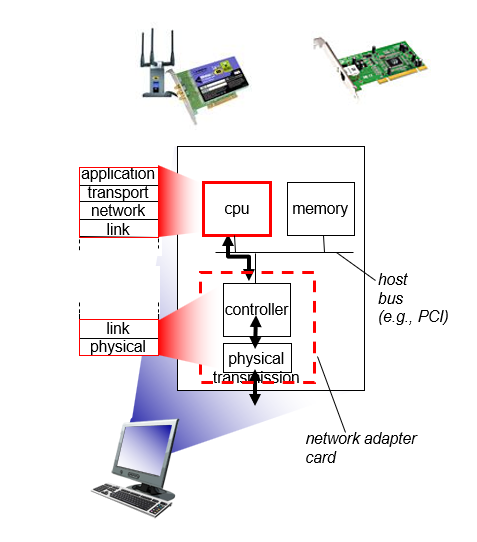

## Error detection, correction

差错检测与纠正的场景如下图所示：

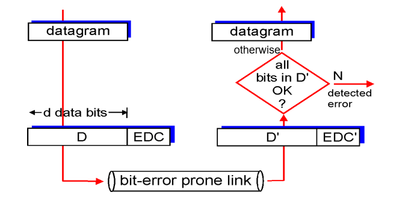

差错检测和纠正技术有：

1. 奇偶校验，包括使用单个**奇偶检验位**（parity bit）和**二维奇偶校验**（two-dimensional parity）；
2. 检验和方法；
3. 循环冗余检测（Cyclic Redundancy Check, CRC）编码

### EDC

- EDC=差错检测和纠正位（冗余位）
- D=数据由差错检测保护，可以包含头部字段错误检测。

错误检测不是 100%可靠的！

- 协议会漏检一些错误，但是很少
- 更长的 EDC 字段可以得到更好的检测和纠正效果

### Parity Checks

**单个奇偶校验位（single bit parity）**：detect single bit errors

发送 d 比特信息附加一个比特使 d+1 比特中 1 的总数是偶数（偶校验）或奇数（奇校验），偶校验如下图所示：

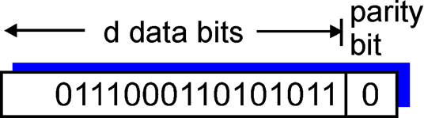

但注意此种方法只能检测不能纠错，并且也不能检测超过 1 比特位的错误。

**二维奇偶校验（two-dimension parity）**：detect and correct single bit errors

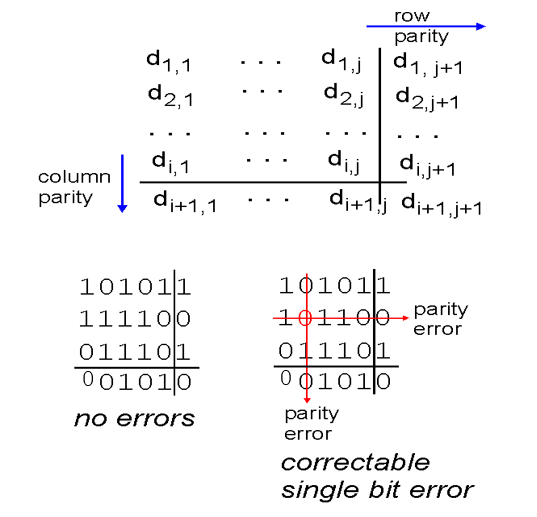

### Cyclic Redundancy Check(CRC)

计算机网络中广泛应用的差错检测技术基于**循环冗余检测（Cyclic Redundancy Check，CRC）编码，也称为多项式编码（polynomial code）**，CRC 如下图所示：

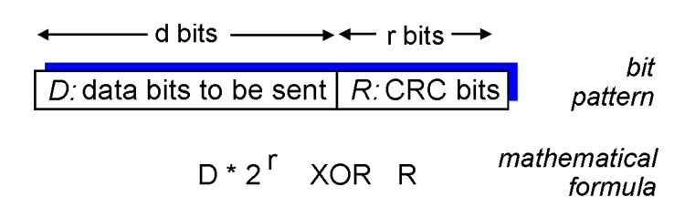

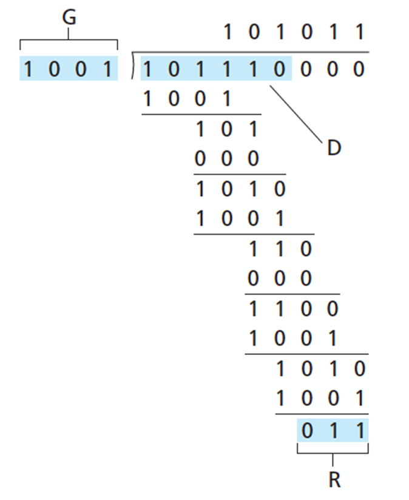

其中 `R` 计算：

$$
R=remainder\frac{D\cdot2^r}{G}
$$

## Multiple access protocols

多路访问链路和协议，或者说全称 Multiple Acess Links and Protocol。

两种类型的网络链路：

- **点对点链路（point-to-point link）**
  - 拨号访问的 PPP
  - 以太网交换机和主机之间的点对点链路
- **广播链路（broadcast link）**：共享线路或媒体
  - 传统以太网
  - HFC 上行链路
  - 802.11 无线局域网

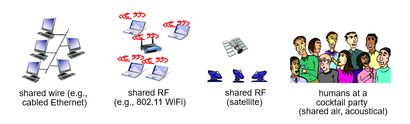

::: tip 多路访问协议

- 单个共享的广播型链路
- 传输的帧在接收方可能在接收方处碰撞/冲突（collide）。
- 分布式算法-决定节点如何使用共享信道，即：决定节点什么时候可以发送？

:::

在理想情况下，对于速率为 R bps 的广播信道，多路访问协议应该具有以下所希望的特性：

1. 当且仅当一个节点发送数据时，该节点具有 R bps 的吞吐量；

2. 当有 M 个节点发送数据时，每个节点吞吐量为 R/M bps。这不必要求 M 个节点中的每一个节点总是有 R/M 的瞬时速率，而是每个节点在一些适当定义的时间间隔内应该有 R/M 的平均传输速率；

3. 协议是分散的，这就是说不会因为某主节点故障而使整个系统崩溃

   （高级的说法：没有特殊节点协调发送、没有时钟和时隙的同步）

4. 协议是简单的，使实现不昂贵

现在主流的 3 种类型多路访问协议（介质访问控制协议，MAC）：

- **信道划分协议（channel partitioning protocol）**
  - 把信道划分成小片（时间、频率、编码）
  - 分配片给每个节点专用
- **随机接入协议（random access protocol）**
  - 信道不划分，允许冲突
  - 冲突后恢复
- **轮流协议（taking-turns protocol）**
  - 节点依次轮流
  - 但是有很多数据传输的节点可以获得较长的信道使用权

### 信道划分协议

Channel Partitioning Protocols

**时分多路复用**（time division multiple access，简称 TDMA）：

- 轮流（“rounds”）使用信道（channel），信道的时间分为周期
- 每个站点使用每周期中固定的时隙（长度=帧传输时间）传输帧
- 时隙空闲（浪费）主要出现在站点无帧传输

**频分多路复用**（frequency division multiple access，简称 FDMA）：

- 信道的有效频率范围被分成一个个小的频段
- 每个站点被分配一个固定的频段
- 浪费主要出现在分配给站点的频段没有被使用

**码分多址**（Code Division Multiple Access，简称 CDMA）

- 所有站点在整个频段上同时进行传输，采用编码原理加以区分
- 完全没有冲突（假定信号同步很好，线性叠加）

### 随机接入协议

> Random Access Protocols

#### Slotted ALOHA

Slotted 时隙，ALOHA 是夏威夷土著语，意为“你好”、“谢谢”。

假设：

- all frames same size

- time divided into equal size slots(时间划分为大小相等的插槽) (time to transmit 1 frame)
- nodes start to transmit only slot beginning(插槽开头)
- nodes are synchronized（同步过）
- if 2 or more nodes transmit in slot, all nodes detect collision(所有节点都检测到冲突)

在每个节点中，时隙 ALOHA 的操作如下：

- 当节点有一个新帧要发送时，它等到下一个间隙开始并在该时隙传输整个帧；
- 如果没有碰撞，该节点成功地传输它的帧，从而不需要考虑重传该帧；
- 如果有碰撞，该节点在时隙结束之前检测到这次碰撞，该节点以概率 p 在后续的每个时隙中重传它的帧，直到该帧被无碰撞的传输出去；

#### Slotted ALOHA: efficiency

效率：当有很多节点，每个节点有很多帧要发送时，x%的时隙是成功传输帧的时隙

- 假设 N 个节点，每个节点都有很多帧要发送，在每个时隙中的传输概率是 p
- 一个节点成功传输概率是 $p(1-p)^{N-1}$
- 任何一个节点的成功概率是 $Np(1-p)^{N-1}$
- N 个节点的最大效率：求出使 $Np(1-p)^{N-1}$ 最大的 p\*
- 代入 P\*得到最大 $f(p^*)=Np^*(1-p^*)^{N-1}$
- N 为无穷大时的极限为 $1/e=0.37$

即最好情况：信道利用率 37%

#### Pure (unslotted) ALOHA

在纯 ALOHA 中，当一帧首次到达，节点立刻将该帧完整地传输进广播信道。

效率上：比时隙 ALOHA 更差了！

#### 载波侦听多路访问

CSMA (carrier sense multiple access)

##### CSMA 规则

两个重要的规则：

1. 说话之前先听。如果其他人正在说话，等到他们说完话为止。在网络领域中，这被称为**载波侦听**（carrier sensing），即一个节点在传输前先听信道。如果来自另一个节点的帧正向信道上发送，节点则等待直到检测到一小段时间没有传输，然后开始传输。
2. 如果与他人同时开始说话，停止说话。在网络领域中，这被称为**碰撞检测**（collision detection），即当一个传输节点在传输时一直在侦听此信道。如果它检测到另一个节点正在传输干扰帧，它就停止传输，在重复“侦听-当空闲时传输”循环之前等待一段随机时间。

> 这两个规则包含在**载波侦听多路访问**（Carrier Sense Multiple Access, CSMA）和**具有碰撞检测的CSMA**（CSMA with Collision Detection, CSMA/CD）协议族中。

##### CSMA 冲突

collisions can still occur: propagation delay(传播延迟) means two nodes may not hear each other’s transmission(无法听到彼此的传输).

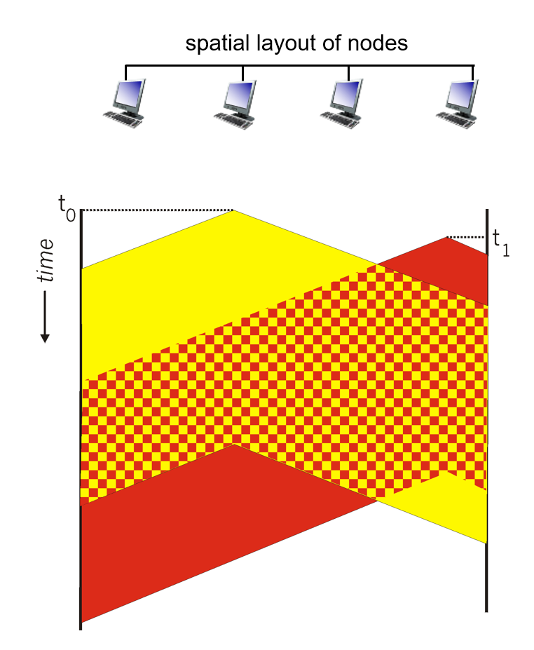

影响：entire packet transmission time waste(浪费整个数据包传输时间), and distance & propagation delay play role in in determining collision probability 距离和传播延迟在确定碰撞概率方面发挥作用

##### CSMA/CD(冲突检测)

CSMA 传播时延越长，载波侦听节点不能侦听到网络中另一个节点已经开始传输的机会就越大。如果一个节点开始传播后发送碰撞，其实此次传播已经失败，将剩余数据传完没有意义，即使中止才是上策，这便是具有CSMA/CD所作改进。

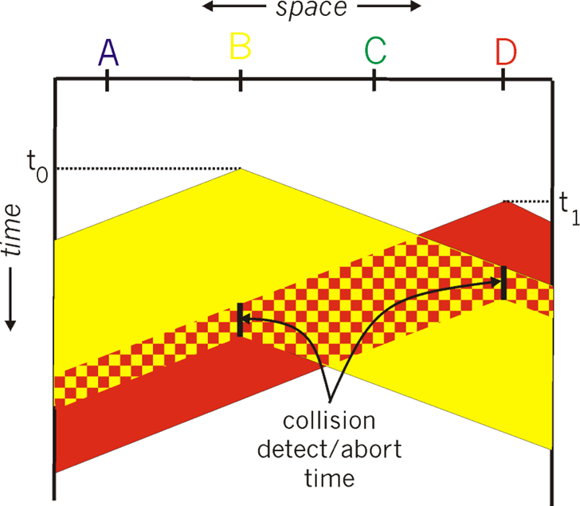

算法：

1. 适配器获取数据报，创建帧

2. 发送前：侦听信道CS

  - 闲：开始传送帧
  - 忙：一直等到闲再发送

3. 发送过程中，冲突检测CD 

   - 没有冲突：成功
   - 检测到冲突：放弃，之后尝试重发

4. 发送方适配器检测到冲突， 除放弃外，还发送一个 Jam 信号，所有听到冲突的适配 
   器也是如此

   > 强化冲突：让所有站点都知道冲突

5. 如果放弃，适配器进入指数退避状态。

   在第m次失败后，适配器随机选择从 $\{0, 1, 2, \cdots, 2^m-1\}$ 中选择一个 K，等待K*512位时，然后转到步骤2

### 轮流协议

channel partitioning(信道划分) MAC protocols:

- share channel efficiently and fairly at high load 共享信道在高负载时是有效和公平的
- inefficient at low load: delay in channel acces 在低负载时效率低下

random access(随机访问) MAC protocols:

- efficient at low load: single node can fully utilize channel 在低负载时效率高：单个节点可以完全利用信道全部带宽
- high load: collision overhead 高负载时：冲突开销较大，效率极低，时间很多浪费在冲突中

“taking turns” protocols(轮流协议): look for best of both worlds!

轮流协议包含：

- **轮询协议**（polling protocol）
- **令牌传递协议**（token-passing protocol）

#### 轮询协议

主节点邀请从节点依次传送；从节点一般比较“dumb”。

缺点：

- 轮询开销：轮询本身消耗信道带宽
- 等待时间：每个节点需等到主节点轮询后开始传输，即使只有一个节点，也需要等到轮询 
  一周后才能够发送
- 单点故障：主节点失效时造成整个系统无法工作

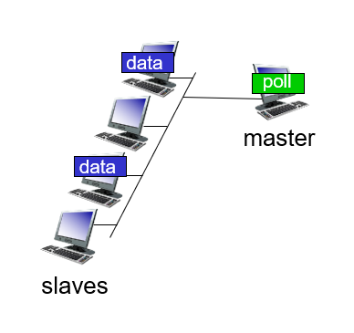

#### 令牌传递协议

控制令牌( token)循环从一个节点到下一个节点传递。

> 令牌报文本质上是一种特殊的帧。 

缺点:

- 令牌开销：本身消耗带宽
- 延迟：只有等到抓住令牌，才可传输
- 单点故障 (token)（令牌丢失系统级故障，整个系统无法传输；复杂机制重新生成令牌）

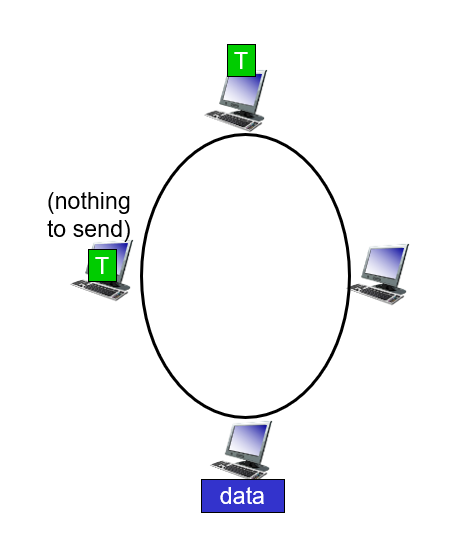

### 线缆接入网络

多个40Mbps 下行(广播)信道，FDM：

- 下行：通过FDM分成若干信道，互联网、数字电视等 
- 互联网信道：只有1个CMTS在其上传输

多个30 Mbps上行的信道，FDM：

- 多路访问：所有用户使用；接着TDM分成微时隙
- 部分时隙：分配、竞争

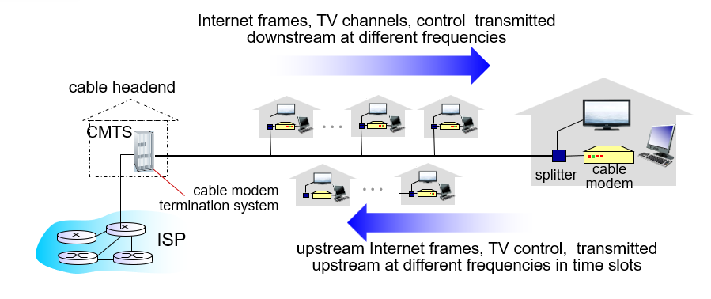

### MAC 协议总结

多点接入问题：对于一个共享型介质，各个节点 如何协调对它的访问和使用?

- 信道划分：按时间、频率或者编码

  - TDMA、FDMA、CDMA

- 随机访问 (动态)

  - ALOHA, S-ALOHA, CSMA, CSMA/CD
  - 载波侦听: 在有些介质上很容易 (wire：有线介质), 但在有些 介质上比较困难 (wireless：无线)
  - CSMA/CD ：802.3 Ethernet网中使用
  - CSMA/CA ：802.11WLAN中使用

- 依次轮流协议

- 集中：由一个中心节点轮询；

  分布：通过令牌控制

- 蓝牙、FDDI、令牌环

## LANs

### Addressing, ARP

32bit 的 IP 地址包含：

- 网络层地址
- 前n-1跳：用于使数据报到达目的IP子网
- 最后一跳：到达子网中的目标节点

LAN（MAC/物理/以太网）地址：

- 用于使帧从一个网卡传递到与其物理连接的另一个网卡 (在同一个物理网络中)
- 48bit MAC地址固化在适配器的ROM，有时也可以通过软件设定
- 理论上全球任何2个网卡的MAC地址都不相同

LAN 地址形如：`1A-2F-BB-76-09-AD`（16进制表示，每一位代表4个bits）

#### LAN 地址和ARP

局域网上每个适配器都有一个唯一的LAN地址。

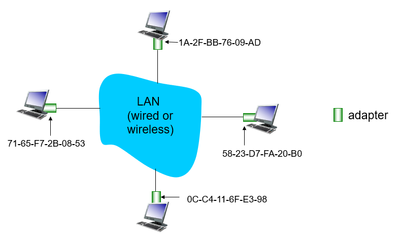

注：

- MAC地址由IEEE管理和分配
- 制造商购入MAC地址空间（保证你的 MAC 是唯一的，全球都没有重复）

类比：MAC地址就好比社会安全号，IP地址就好比通讯地址。

但由于MAC平面地址，并且是固定的，所以支持移动。

#### ARP: Address Resolution Protocol

::: tip 已知B的IP地址，如何确定B的MAC地址？

在LAN上的每个IP节点都有一个ARP表。

ARP表包括一些 LAN节点IP/MAC地址的映射：`< IP address; MAC address; TTL>`。其中TTL时间是指地址映射失效的时间。典型是20min。

:::

> [How Address Resolution Protocol (ARP) works? - GeeksforGeeks](https://www.geeksforgeeks.org/how-address-resolution-protocol-arp-works/)
>
> The acronym ARP stands for **Address Resolution Protocol** which is one of the most important protocols of the Network layer in the OSI model. It is responsible to find the hardware address of a host from a known IP address. There are three basic ARP terms. ARP 代表地址解析协议，它是 OSI 模型中网络层最重要的协议之一。它负责从已知 IP 地址中查找主机的硬件地址。
>
> 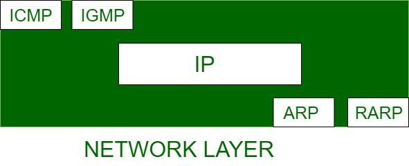

> [ARP(地址解析协议)_傲娇回忆杀的博客-CSDN博客](https://blog.csdn.net/weixin_62594100/article/details/123992695)
>
> 我们以以太网的工作环境作为背景来探讨这一协议（串行链路由于是点到点链路，故而不需要ARP）。在以太网的工作环境中，当主机需要向一个IP地址发送数据时，它需要将目标的物理地址（也就是MAC地址，也有文献称其为硬件地址）写在数据帧的目的MAC地址字段位置上，而这一动作的前提是，网络层已经知道了这一地址并且将其与逻辑目的地址建立了一个映射关系。这就好比在手机上存了一个电话号码并备注上了一个联系人一样，当需要打电话时，只需要查找该联系人的姓名即可，手机会帮我们自动选择他的电话号码拨过去。
>
> 当我们并不知道一台主机的IP地址与物理地址的映射关系的时候，就需要用到ARP。
>
> ### ARP 分类：普通 ARP
>
> 我们用一个简单的比喻来形容ARP的工作过程。当你只知道你跟张三是同班同学却不知道他的具体座位时，你站起来大喊了一声：“我是王二，谁是张三？”于是张三说：”我是张三。“这样，你就知道了张三的具体位置，同时张三也知道了你的位置和姓名。
>
> 如下图所示为一个ARP请求报文的示例。
>
> 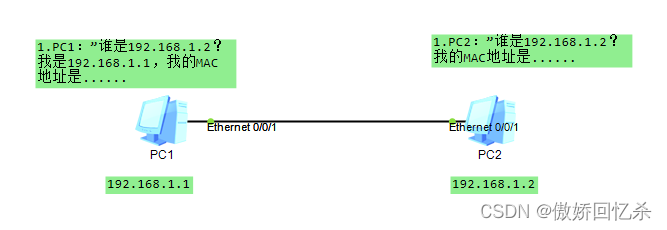
>
> 当一台主机需要访问一个与自己在同一个网络的IP地址但不知道目的主机的物理地址时，它就会发送一个ARP请求报文。由于我们并不知道目标物理地址是什么，该报文的目标物理地址（即MAC地址）在数据帧的头部用二层广播地址FFFF.FFFF.FFFF来填充。
>
> 一个二层目的地址为广播地址的数据帧是会被发送给广播域内所有的成员的，如果网络规划正确，那么这其中一定会包含真正的接收者。当真正的接收者收到该数据帧之后，会转交给自身的ARP程序，经过比对，发现其中的目的IP地址正是其所拥有的，就会对发送者做出回应，在回应报文中会将自身的物理地址写在发送者MAC地址的位置。
>
> 一次美妙的陌生人之间的互相介绍就这样完成了。看起来是不是很简单呢？
>
> ### ARP 分类：代理 ARP
>
> 在一般情况下，只能为主机分配一个默认网关。如果需要互通的主机处在相同的网段却不在同一物理网络，并且连接主机的网关设备具有不同的网关地址，在这种场景中，如果发生网络故障，我们该如何防止业务中断呢？在这种场景中，需要代理ARP，其工作过程如下图所示。
>
> 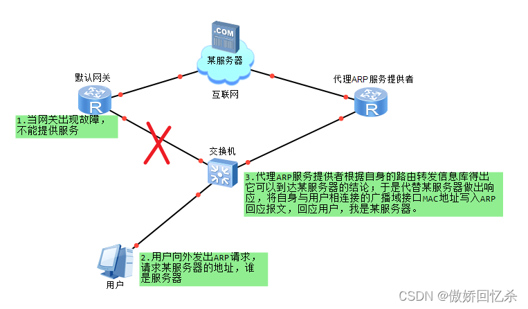
>
> 可以看出，实际上，代理ARP只是一种服务，它并不是一种协议。并且，服务提供者对用户进行了“欺骗”，只是将自身的MAC地址回应给了用户，以此来达到代替用户转发数据的目的。
>
> ### ARP 报文格式
>
> ARP 协议包（ARP 报文）主要分为 ARP 请求包和 ARP 响应包。ARP 协议是通过报文进行工作的，ARP 报文格式如图所示。
>
> 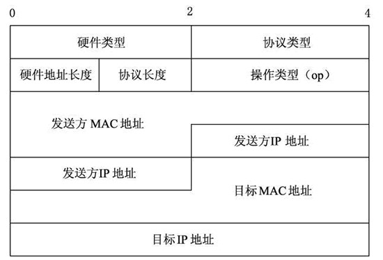
>
> ARP 报文总长度为 28 字节，MAC 地址长度为 6 字节，IP 地址长度为 4 字节。
>
> 其中，每个字段的含义如下。
>
> - 硬件类型：指明了发送方想知道的硬件接口类型，以太网的值为 1。
> - 协议类型：表示要映射的协议地址类型。它的值为 0x0800，表示 IP 地址。
> - 硬件地址长度和协议长度：分别指出硬件地址和协议的长度，以字节为单位。对于以太网上 IP 地址的ARP请求或应答来说，它们的值分别为 6 和 4。
> - 操作类型：用来表示这个报文的类型，ARP 请求为 1，ARP 响应为 2，RARP 请求为 3，RARP 响应为 4。
> - 发送方 MAC 地址：发送方设备的硬件地址。
> - 发送方 IP 地址：发送方设备的 IP 地址。
> - 目标 MAC 地址：接收方设备的硬件地址。
> - 目标 IP 地址：接收方设备的IP地址。

#### ARP协议：在同一个LAN （网络）

流程：

- 首先，A要发送**帧**给B（其中B的IP地址已知)， 但B的MAC地址并不在A的ARP表中。

  ::: tip
  发送帧只能在同一个网关下进行，不能穿透路由器前往别的网络。
  :::

  所以，A广播了包含B的IP地址的 ARP查询包：Dest MAC address = FF-FF-FF-FF-FF-FF

  LAN 上的所有节点都会收到该查询包。

- B接收到ARP包，回复A自己的MAC地址（帧发送给A、用A的MAC地址，即单播）。

- A收到帧之后，在自己的ARP表中，缓存 IP-to-MAC地址映射关系 ，直到信息超时。

  ::: tip

  - 软状态：靠定期刷新维持的系统状态
  - 定期刷新周期之间维护的状态信息可能和原有系统不一致

  :::

ARP是即插即用的：

- 节点自己创建ARP的表项
- 无需网络管理员的干预

#### ARP协议：路由到其他LAN

流程：

- A创建**数据报**，源IP地址：A；目标IP地址：B 封装一层

  ::: tip

  为了跨网络，只能使用数据报格式。

  :::

- 1

### Ethernet

### Switches

### VLANS

