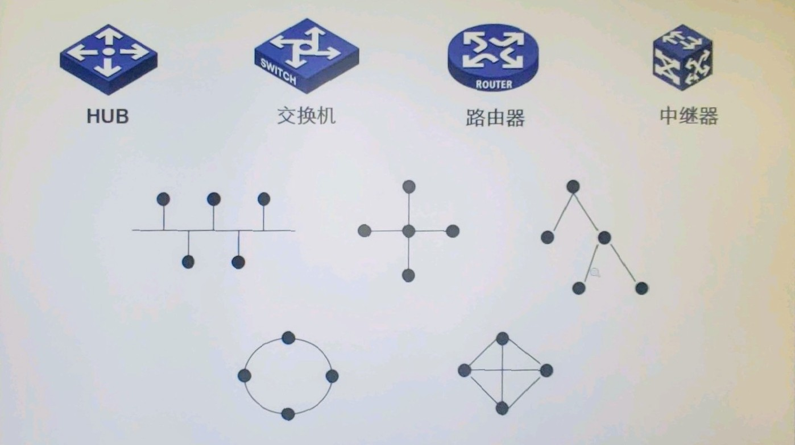

# 1. 网络基础知识及双绞线的制作

## 实验目的

- 熟悉和了解实验室的网络设备和环境，认识常见的网络设备外观，基本构造；
- 了解和学习 TCP/IP 协议的基本原理，学习如何进行基本的网络地址规划。
- 掌握双绞线的制作方法和制作工艺；
- 掌握双绞线的接线标准 T568A、T568B；
- 掌握双绞线的检测方法，了解常见的连接方式；
- 认识常见的网络设备外观，基本构造；
- 了解小型局域网的组建方式。
- 掌握 TCP/IP 协议的设置方法。

## 实验原理

### IP 地址介绍

- IP 地址唯一标识一台网络设备
- IP 地址以点分十进制的方式进行表示
- IP 地址通常分为网络位和主机位两部分

IP 地址分四个字段，不同字段之间用点隔开。其中每个字段支持 8 位数的二进制编码，也就是说，在十进制层面上最高支持 255（即二进制的 11111111）。

私有地址范围：

1. 10.0.0.1    ~ 10.255.255.254
2. 172.16.0.1  ~ 172.31.255.254
3. 192.168.0.1 ~ 192.168.255.254

子网掩码：用来指明一个 IP 地址的哪些位标识的是主机所在的子网，以及哪些位标识的是主机的位掩码。子网掩码不能单独存在，它必须结合 IP 地址一起使用。

默认子网掩码：

| 类别 | 子网掩码的二进制数值                | 子网掩码的十进制数值 |
| ---- | ----------------------------------- | -------------------- |
| A    | 11111111 00000000 00000000 00000000 | 255.0.0.0            |
| B    | 11111111 11111111 00000000 00000000 | 255.255.0.0          |
| C    | 11111111 11111111 11111111 00000000 | 255.255.255.0        |

我们一般遇到的子网掩码就是类别 C，意思是前三个字段代表网络部分，最后一个字段代表主机部分。

### 协议

- 物理协议：不同设备接线、机械通讯协议，是最底层的协议
- 网络协议：如 IP（Internet Proxy）
- 软件协议：软件自己的协议如 Twitter 通讯协议、Tiktok 软件通讯协议

### 常见网络设备的拓扑标志

### 双绞线

双绞线是由两条相互绝缘的导线按照一定的规格互相缠绕在一起儿子做成的一种通用配线，属于信息通信网络传输介质。

1. 传输速率大致在 100Mb/s 左右，最好不要超过 100 米。
2. 不要超过一定的角度扭曲，会影响传输速率（电路干扰）。
3. 有两个水晶头连接到其他设备：新的连接互联网的水晶头能满足 `RJ45` 物理层协议；旧的家用固话一般使用协议 `RJ11`。
4. 检测双绞线是否有问题，可通过“专用测试电表”测试，测试正常且成功的情况下，会有绿灯成排向上移动“闪烁”。
5. 使用通断仪可以测量双绞线的实际速率。当然也可以直接连接电脑等设备测试速率。

### 双绞线分类

绞线分为屏蔽双绞线 STP（Shield Twisted-Pair）和非屏蔽双绞线 UTP（Unshielded Twisted-Pair）。UTP 由多对双绞线和一个绝缘外皮构成，是目前使用最为广泛的传输介质。

按照 EIA/TIA 568A 标准，UTP 可分为 1~6 类，其中计算机使用的是 3、5、6 类，分别提供 16、100、250MHz 的带宽。

构建局域网常采用 CAT-5 或 CAT-5e 类线。双绞线制作有两种接线标准，即 T568A 和 T568B 标准。其中 T568B 标准是 100MHz 局域网中常用的接线方式。两者物理层面的差异是在 1、3 脚位和 2、6 脚位交叉。

T568A 标准：

| 脚位 |  1   |  2  |  3   |  4  |  5   |  6  |  7   |  8  |
| :--: | :--: | :-: | :--: | :-: | :--: | :-: | :--: | :-: |
| 颜色 | 绿白 | 绿  | 橙白 | 蓝  | 蓝白 | 橙  | 棕白 | 棕  |

T568B 标准：

| 脚位 |  1   |  2  |  3   |  4  |  5   |  6  |  7   |  8  |
| :--: | :--: | :-: | :--: | :-: | :--: | :-: | :--: | :-: |
| 颜色 | 橙白 | 橙  | 绿白 | 蓝  | 蓝白 | 绿  | 棕白 | 棕  |

按双绞线的两端线序分可以分为直连线（Straight Line）和 交叉线（Cross-over Line）。直连双绞线：双绞线的两端线序相同；交叉双绞线：一端为 T568A 标准，另一端为 T568B 标准，当两个计算机互相连接为非常规方式，有时可能会用到这种。

|             | 计算机 | 路由器 | 交换机 MDIX | 交换机 MDI |
| ----------- | ------ | ------ | ----------- | ---------- |
| 计算机      | 交叉   | 交叉   | 直连        | N/A        |
| 路由器      | 交叉   | 交叉   | 直连        | N/A        |
| 交换机 MDIX | 直连   | 直连   | 交叉        | 直连       |
| 交换机 MDI  | N/A    | N/A    | 直连        | 交叉       |

## 实验步骤

### 制作双绞线

1. 使用夹线器夹断线，大约 20~30cm
2. 使用夹线器的孔位使内部双绞线裸露，大约裸露 2~3cm
3. 简单理清双绞线顺序，尽可能贴近 [[T568B 标准]]
4. 使用夹线器的平板夹位使双绞线长短一致，大约裸露 1.5cm
5. 将双绞线顺序再次整理，对着水晶头金属片方向插入水晶头内
6. 检查双绞线顺序，如无误，将水晶头插入夹线器的水晶头孔，注意插入方向、双绞线松动情况
7. 压下夹线器，制作完成

### 测试双绞线连通

1. 将专业双绞线测试器的顶部的左右两个端口对接上测试双绞线的两头
2. 打开测试器，调节到合适挡位
3. 观察指示灯变化，正常情况下会有 ”1-1“、”2-2“ ... 灯光逐步跳动，表示两个端口的对应双绞线连接正确

### 测试双绞线的电脑连接能力

1. 使用两条双绞线分别将两台 PC 的端口 `PC*` 连接至同一台交换机的不同接口 `S*L*`
2. 修改电脑网络设置：
   1. 前往系统设置 → 网络和 Internet → 高级适配器设置
   2. 禁用默认的本地连接，启用额外通道（如本地连接 1），此时如果正常会提示缆线已接入，否则会看到红色的 “❌” 图标提示
   3. 设置额外通道属性，并修改其 IPv4 协议配置，IP 地址设置为 `192.168.0.*`（注意不同 PC 的设置），子网掩码为 `255.255.255.0`
3. 打开终端工具，如 CMD、Powershell
4. 使用命令 `ping 192.168.0.*` 测试对方 PC 的连通性，如显示 `Timeout` 则为失败
