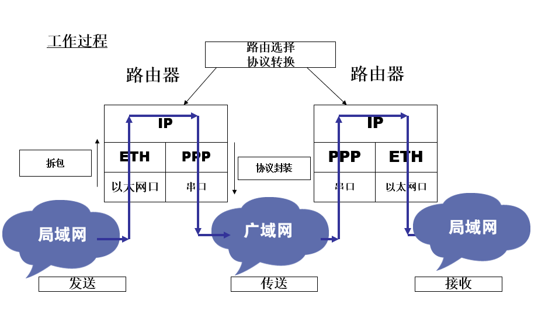
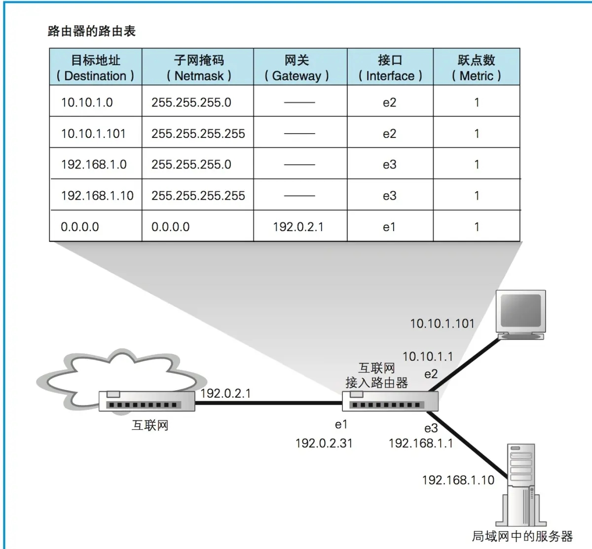
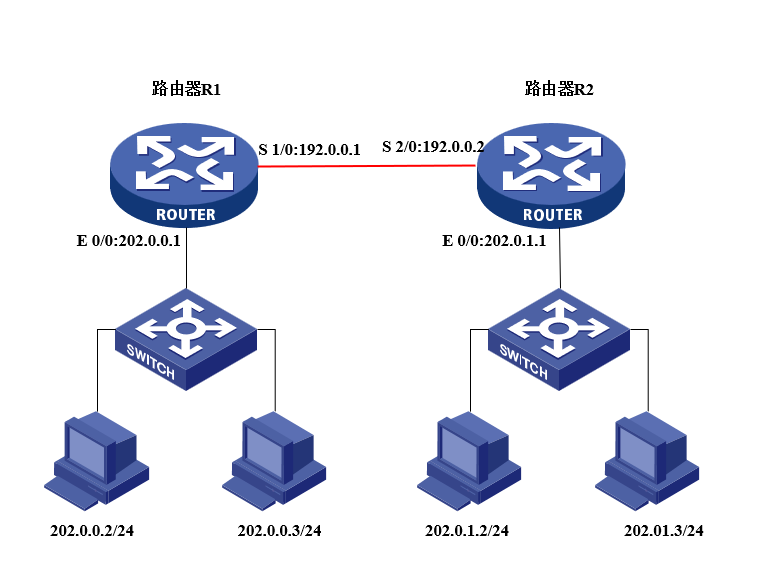

# 4. 路由器基本配置及静态路由配置

## 实验目的

了解路由器的功能和组成结构。掌握路由器的基本配置方法。掌握静态路由和动态路由协议 RIP 的配置。

## 实验原理

### 初步认识路由器

路由器 - 工作在 OSI 参考模型第三层的网络设备：用于网络互连的设备。

作为路由器，必须具备：

- 两个或两个以上的接口
- 协议至少向上实现到网络层
- 具有存储、转发、寻径功能

路由器基本组成：

1. 转发模块：通过查找路由表记录，判断下一个转发目标
2. 端口模块：有支持 ADSL 路由器，支持专线线路路由器，通过端口模块，对接收到的包进行接收进来，这一步取决于端口所对应的通信技术。如果是以太网，则按照以太网规则进行接收，如果是无线局域网，则按照无线局域网进行接收。总之，目的就是委托端口的硬件对网络包进行接收。

路由器的核心作用：实现网络互连

- 分组数据转发
- 路由（寻径）：路由表建立、刷新、查找
- 子网间的速率适配
- 隔离网络，防止网络风暴，制定访问规则（防火墙）
- 异种网络互连

### 路由器的接口

在路由器的背板上，有以太网口（Ethernet，用于连接局域网）和串口（Serial，用于连接广域网）。在本实验中，路由器的串口是通过 V.35 电缆进行连接的，而以太口连接在机柜的面板上，如 R1L0 即是指路由器 1 的 0 号以太口。

### 路由器工作流程



### 路由表信息

路由表记录了接收方 IP 地址与转发目标之间的关系：

- 第一列记录了接收方 IP 地址（只表示子网的网络号比特值，忽略主机号）。
- 第二列表示子网掩码，记录需要匹配网络号的比特数，路由器在匹配接收方 IP 过程中，通过子网掩码就知道需要匹配的网络号的比特数是多少，相当于我们生活中快递在转发过程中所经过的省，市，区，县，区域范围逐层减小。
- 第三列表示网关，网络包的转发目标。
- 第四列表示接口，在匹配到具体记录后，路由器会将网络包转发到网关（具体 IP 地址）的指定接口上（端口）。
- 第五列表示跃点数，表示距离目标 IP 地址的距离是远还是近，数字越小，表示距离目的地越近，数字越大，表示距离目的地越远。



有的路由表也可能包含：

- Destination/Mask：目标地址/子网掩码
- Proto：路由协议
- Pre：优先级
- Cost：开销
- Nexthop：下一跳
- Interface：接口

### DCE 与 DTE

DCE（Data Circuit-terminating Equipment，**数据通信设备**或者数据电路终端设备）：该设备和其与通信网络的连接构成了网络终端的用户网络接口。它提供了到网络的一条物理连接、转发业务量，并且提供了一个用于同步 DCE 设备和 DTE 设备之间数据传输的时钟信号。调制解调器和接口卡都是 DCE 设备的例子。

DTE（Data Terminal Equipment，**数据终端设备**）：指的是位于用户网络接口用户端的设备，它能够作为信源、信宿或同时为二者。数据终端设备通过数据通信设备（例如，调制解调器）连接到一个数据网络上，并且通常使用数据通信设备产生的时钟信号。数据终端设备包括计算机、协议翻译器以及多路分解器等设备。

DTE 和 DCE 是两种数据通信设备之间的术语。DTE 是数据终端设备，指的是发送或接收数据的设备，例如个人电脑、路由器或交换机等。DCE 是数据通信设备，用于使 DTE 设备之间的数据传输更加有效率。其中最常见的 DCE 设备可能是调制解调器，也就是用于在计算机之间传输数据的设备。

以拨号上网为例，计算机作为 DTE 设备，将调制解调器作为 DCE 设备。当计算机需要通过电话线连接到互联网时，它会将数据传输到调制解调器。该调制解调器会将数字信号转换为模拟信号以通过电话线传输。当数据到达目的地时，另一个调制解调器将模拟信号转换为数字信号，并将其传输给目标计算机的 DTE 设备。

::: tip
调制解调器是一种设备，它可以将数字信号转换为模拟信号并将其发送到电话线或数字信道中，并且可以将这些模拟信号接收并转换回数字信号以进行处理。在互联网的早期发展阶段，调制解调器是计算机连接到互联网的唯一方式。该设备支持计算机与网络之间的数据传输，以用于传输电子邮件、文本文件、图像、音频、视频等信息。现在，随着宽带网络的普及，调制解调器已经被更快、更便捷的网络连接方式所取代，如光纤、DSL（数字用户线，利用电话线传输数字信号，详见[Chapter 2@DSL](https://cn.cworld.top/01-introduction.html#dsl)）、电缆调制解调器（有线电缆）和无线网络（Wi-Fi）等。
:::

### 静态路由

静态路由（Static Routing）是在路由器中设置固定的路由表。由网络管理员管理路由表。由于静态路由不能对网络的改变作出反映，一般用于网络规模不大、拓扑结构固定的网络中。优点是简单、高效、可靠。在所有的路由中，静态路由优先级最高。当动态路由与静态路由发生冲突时，以静态路由为准。

命令：

```shell
ip route-static ip-address {mask|mask-length} [interface-type interface-number] [nexthop-address] [preference preference-value] [reject|blackhole] [tag tag-value] [description string]
```

## 实验步骤

路由器接口与机柜上接口标签的对应关系：

路由器的以太网口连接上机柜上方的 RJ-45 接口，1 号路由器的 Ethernet 0/0 对应 R1L0， Ethernet 1/0 对应 R1L1，以此类推；

p 路由器的串口连接在机柜顶部的 V.35 线缆，1 号路由器的 Serial 1/0 口对应顶部的标签为 R1S1 的 DCE（或 DTE）接头，Serial 2/0 口对应顶部的标签为 R1S2 的 DCE（或 DTE）接头，以此类推。

1. 按图示搭建网络环境：

   

2. 设置 IP 地址

   路由器 R1 的设置：

   - 通过超级终端，进入路由器控制口。
   - `system-view`：进入系统视图。
   - `sysname R1`：重命名路由。
   - `interface Ethernet 0/0`：进入以太网 0 口的接口视图
   - `ip address 202.0.0.1 24`：设置 ip 地址

   - `interface serial 1/0`：再进入串口的 1/0 口

   - `ip address 192.0.0.1 24`：设置 ip 地址

   路由器 R2 的设置：

   进入系统视图后，进入以太网 0 口的接口视图，设置 ip 地址：

   - `system-view`
   - `sysname R2`
   - `interface Ethernet 0/0`
   - `ip address 202.0.1.1 24`

   再进入串口的 2/0 口，设置 ip 地址：

   - `interface serial 2/0`
   - `ip address 192.0.0.2 24`

3. 设置 PC 的 IP 地址，并将网关指向所连接的路由器的以太口。

   设置完成后，可以在路由器上看到以太口和串口的状态转为 Up，出现类似下面的提示：

   ```
   %Oct 22 17:19:16:602 2007 RouteR1 IFNET/5/UPDOWN:PPP IPCP protocol on the interface Serial0/0 is UP
   ```

   此时在 PC 上 ping 网关或本地路由器的串口，应该 ping 通 （请将多余的本地连接禁用），如果 ping 不通，请检查交换机的配置，是否有 vlan 阻止了数据包的通过。

   但在 pc 上 ping 对端路由器的 ip 地址或其以太网上的 pc，不能 ping 通 ，这是因为本地路由器上还没有对方网段的路由信息，数据包无法获知到达对端的路径。

4. 设置静态路由

   R1 上的配置：`ip route-static 202.0.1.0 255.255.255.0 192.0.0.2`

   R2 上的配置：`ip route-static 202.0.0.0 255.255.255.0 192.0.0.1`

5. 使用默认路由设置静态路由

   ::: tip
   默认路由是静态路由的一种，当目标网络为 `0.0.0.0` 时，表示任何发往外网的数据包都将发往指定的下一跳地址。
   :::

   R1 上的配置：`ip route-static 0.0.0.0 0.0.0.0 192.0.0.2`

   R2 上的配置：`ip route-static 0.0.0.0 0.0.0.0 192.0.0.1`

   建立了静态路由后，可以在路由器上用命令`display ip routing-table`查看路由表，检查路由器上是否有到达对端的路由项。也可以用 `display ip routing-table protocol static` 命令查看是否正确配置。

   ```
   [R1] display ip routing-table
   Routing Table: public net
   Destination/Mask Proto Pre Cost Nexthop Interface
   1.1.1.0/24 DIRECT 0 0 1.1.1.1 Interface Serial1/0/0
   1.1.1.1/32 DIRECT 0 0 127.0.0.1 InLoopBack0
   2.2.2.0/24 DIRECT 0 0 2.2.2.1 Interface serial2/0/0
   2.2.2.1/32 DIRECT 0 0 127.0.0.1 InLoopBack0
   3.3.3.0/24 DIRECT 0 0 3.3.3.1 Interface ethernet1/0/0
   3.3.3.1/32 DIRECT 0 0 127.0.0.1 InLoopBack0
   4.4.4.0/24 DIRECT 0 0 4.4.4.1 Interface ethernet2/0/0
   4.4.4.1/32 DIRECT 0 0 127.0.0.1 InLoopBack0
   127.0.0.0/8 DIRECT 0 0 127.0.0.1 InLoopBack0
   127.0.0.1/32 DIRECT 0 0 127.0.0.1 InLoopBack0
   ```

   如果配置正确，应该有到达对方网段的路由信息。

6. 删除全部静态路由：`delete static-routes all`
