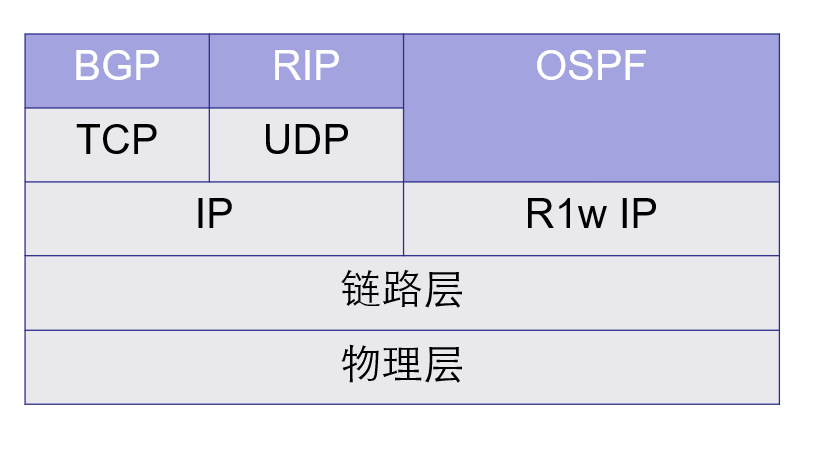

# 5. 动态路由协议的配置

## 实验目的

掌握动态路由协议 RIP 和 OSPF 的配置方法。

## 实验原理

动态路由（Dynamic Routing）是网络中的路由器之间相互通信，传递路由信息，利用收到的路由信息动态更新路由器表的过程。它能实时地适应网络结构的变化。如果路由更新信息表明发生了网络变化，路由选择软件就会重新计算路由，并发出新的路由更新信息。这些信息通过各个网络，引起各路由器重新启动其路由算法，并更新各自的路由表以动态地反映网络拓扑变化。动态路由适用于网络规模大、网络拓扑复杂的网络。当然，动态路由协议会不同程度地占用网络带宽和 CPU 资源。

在设置动态路由之前，先用命令 `delete static-routes all` 将所有静态路由删除。

### 动态路由协议简述

> [动态路由协议概述 - 知乎 (zhihu.com)](https://zhuanlan.zhihu.com/p/164747890)
>
> 动态路由协议，就是**路由器能够自己建立路由表**，不需要管理员手动一条一条将路由加表，这样就节省了许多人力。同时当网络中出现故障时，路由器可以自行检测链路，并选择最优的路径进行数据转发。
>
> **所有的动态路由协议在 TCP/IP 协议栈中都属于应用层的协议。但是不同的路由协议使用的底层协议不同。**
>
> OSPF 将协议报文直接封装在 IP 报文中，协议号 89，由于 IP 协议本身是不可靠传输协议，所以**OSPF 传输的可靠性需要协议本身来保证**。
>
> **BGP 使用 TCP 作为传输协议，提高了协议的可靠性，TCP 的端口号是 179。RIP 使用 UDP 作为传输协议，端口号 520。**
>
> IS-IS 协议是开放系统互联（OSI）协议中的网络层协议，IS-IS 协议基础是 CLNP（Connectionless Network Protocol，无连接网络协议）。
>
> 所以，常见的动态路由有 RIP、OSPF、ISIS、BGP 等，其中 BGP 是唯一一个用于 AS 与 AS 之间的路由协议，其他三个都是用于 AS 内部的路由协议。
>
> **动态路由共同具有的特点：**
>
> 1. 无需管理员手工维护，减轻了管理员的工作量。
> 2. 占用了网络带宽。
> 3. 在路由器上运行路由协议，使路由器可以自动根据网络拓扑结构的变化调整路由条目。
>
> **路由器协议性能指标：**
>
> - 正确性：能够正确找出最优的路由，且无自环。
>
> - 快收敛：当网络的拓扑结构发生变换之后，能够迅速在自治系统中作相应的路由改变。
>
> - 低开销：协议自身的开销（内存、CPU、网络带宽）最小。
>
> - 安全性：协议自身不易受攻击，有安全机制。
>
> - 普适性：适应各种拓扑结构和规模的网络。

IS-IS、OSPF 和 BGP 路由协议：

- IS-IS（Intermediate System to Intermediate System）是一种内部网关协议（IGP），用于在单个自治系统内部的路由选择。IS-IS 是一种链路状态路由协议，与 OSPF 类似，但是 IS-IS 使用 CLNS 协议来传输数据包，而 OSPF 使用 IP 协议来传输数据包。
- OSPF（Open Shortest Path First）是一种内部网关协议（IGP），用于在单个自治系统内部的路由选择。OSPF 是基于 SPF 算法的链路状态路由协议，适用于分层网络拓扑或设计。
- 是一种外部网关协议（EGP），用于在不同自治系统之间的路由选择。BGP 是基于路径矢量路由协议，并适用于网状拓扑或设计。BGP 的路由表大小决定了所需的设备资源。

### 动态路由协议在协议栈中的位置



### 现有路由协议的性能比较


### RIP 协议

RIP 是 Routing Information Protocol（路由信息协议）的简称，是距离矢量路由协议的一个具体实现。（如今 RIP 已经不怎么用了）

RIP 协议适用于中小型网络，有 RIP-1 和 RIP-2。其中 RIP-2 使用组播（224.0.0.9）发送，支持验证和 VLSM。

RIP 支持：水平分割、路由中毒和触发更新。

RIP 协议配置命令：

- `rip`：启动 RIP 协议，进入 RIP 协议配置视图

- `network network-number`：在指定的网络上使能 RIP

- `peer IP-address`：配置报文的定点传送（不支持广播时）

- `rip version 1`：指定接口版本 1（接口视图下）

- `rip version 2 [broadcast|multicast]`：指定接口版本 2

## 实验步骤

### STEP 1：搭建基本路由器网络

按图示搭建网络环境：


1、通过超级终端，进入路由器 R1 的控制口并进行设置：

- `system-view`：进入系统视图
- `sysname R1`：重命名路由器
- `interface Ethernet 0/0`：进入以太网 0 口的接口视图
- `ip address 202.0.0.1 24`：设置 ip 地址
- `interface serial 1/0`：进入串口的 1/0 口
- `ip address 192.0.0.1 24`：设置 ip 地址

2、路由器 R2 的设置：

进入系统视图后，进入以太网 0 口的接口视图，设置 ip 地址：

- `system-view`：进入系统视图
- `sysname R2`：重命名路由器
- `interface Ethernet 0/0`：进入以太网 0 口的接口视图
- `ip address 202.0.1.1 24`：设置 ip 地址
- `interface serial 2/0`：进入串口的 2/0 口
- `ip address 192.0.0.2 24`：设置 ip 地址

3、设置 PC 的 IP 地址，并将网关指向所连接的路由器的以太口。

设置完成后，可以在路由器上看到以太口和串口的状态转为 Up，出现类似下面的提示：

```log
%Oct 22 17:19:16:602 2007 RouteR1 IFNET/5/UPDOWN:PPP IPCP protocol on the interface Serial0/0 is UP
```

此时在 PC 上 ping 网关或本地路由器的串口，应该 ping 通 （请将多余的本地连接禁用），如果 ping 不通，请检查交换机的配置，是否有 vlan 阻止了数据包的通过。

但在 pc 上 ping 对端路由器的 ip 地址或其以太网上的 pc，不能 ping 通 ，这是因为本地路由器上还没有对方网段的路由信息，数据包无法获知到达对端的路径。
