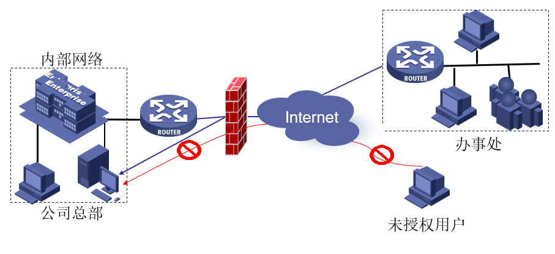
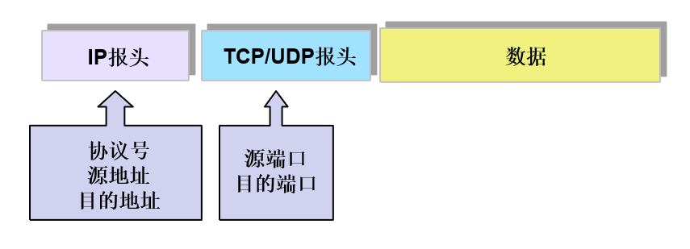
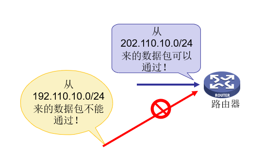
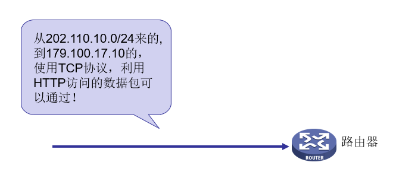
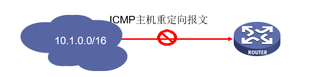
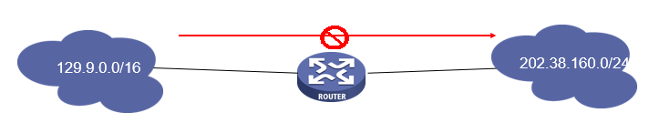
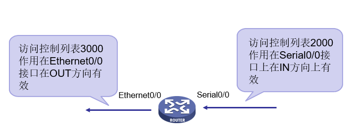
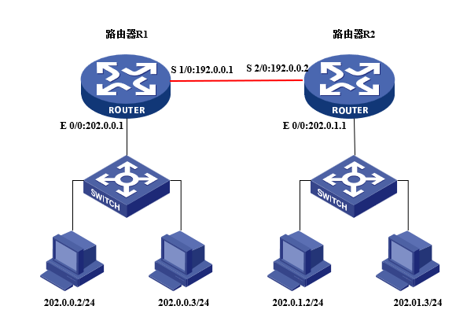

# 6. 访问控制列表及防火墙使用

## 实验目的

学习访问控制列表 ACL 的配置方法，学习防火墙的基本使用方法。

## 实验原理

### IP 包过滤技术

对路由器需要转发的数据包，先获取包头信息，然后和设定的规则进行比较，根据比较的结果对数据包进行转发或者丢弃。而实现包过滤的核心技术是访问控制列表。



### 访问控制列表

访问控制列表的作用：

- 访问控制列表可以用于防火墙；
- 访问控制列表可以用于 QoS（Quality of Service），对数据流量进行控制；
- 在 DCC 中，访问控制列表还可用来规定触发拨号的条件；
- 访问控制列表还可以用于地址转换；
- 在配置路由策略时，可以利用访问控制列表来作路由信息的过滤。

访问控制列表的定义：

一个 IP 数据包如下图所示（图中 IP 所承载的上层协议为 TCP/UDP）：



::: tip
对于 TCP/UDP 来说，这 5 个元素组成了一个 TCP/UDP 相关，访问控制列表就是利用这些元素定义的规则
:::

访问控制列表的分类：

按照访问控制列表的用途可以分为四类:

- 基本的访问控制列表（basic acl）
- 高级的访问控制列表（advanced acl）
- 基于接口的访问控制列表（interface-based acl）
- 基于 MAC 的访问控制列表（mac-based acl）

访问控制列表的标识：

- 利用数字标识访问控制列表
- 利用数字范围标识访问控制列表的种类

| 列表的种类                | 数字标识的范围 |
| ------------------------- | -------------- |
| 基于接口的访问控制列表    | 1000 ～ 1999   |
| 基本的访问控制列表        | 2000 ～ 2999   |
| 高级的访问控制列表        | 3000 ～ 3999   |
| 基于 MAC 地址访问控制列表 | 4000 ～ 4999   |

### 基本访问控制列表

基本访问控制列表只使用源地址描述数据，表明是允许还是拒绝。

配置基本访问列表的命令格式如下：

- `acl number <acl-number> (match-order {config|auto})`
- `rule (rule-id) {permit|deny} [source sour-addr sour-wildcard|any] [time-range time-name] [logging] [fragment] [vpn-instance vpn-instanc-name]`

反掩码和子网掩码相似，但写法不同：

- 0 表示需要比较
- 1 表示忽略比较

反掩码和 IP 地址结合使用，可以描述一个地址范围：

| First quarter | Second quarter | Third quarter | Last quarter | Comment        |
| ------------- | -------------- | ------------- | ------------ | -------------- |
| 0             | 0              | 0             | 255          | 只比较前 24 位 |
| 0             | 0              | 3             | 255          | 只比较前 22 位 |
| 0             | 255            | 255           | 255          | 只比较前 8 位  |

反掩码的实质：**根据掩码，按位取反**

如：

- 匹配 192.168.0.0 /16 网段，反掩码应该为 0.0.255.255
- 匹配 192.168.1.0 /26 网段，反掩码应该为 0.0.0.(255-192)=0.0.0.63
- 0.0.0.0 0.0.0.0 匹配所有地址，等同于 any
- 192.168.1.5 0.0.0.0 匹配单独的 ip 地址
- 192.168.1.5 255.255.255.255 根据反掩码，都不匹配，也等同于 any

实例如：

```shell
acl number 2000
rule 1 deny source 192.110.10.0 0.0.0.255
rule 2 permit source 202.110.10.0 0.0.0.255
rule 3 permit source any
```



### 高级访问控制列表

高级访问控制列表使用除源地址外更多的信息描述数据包，表明是允许还是拒绝。

高级访问控制列表规则的配置命令：

```shell
rule [rule-id] {permit|deny} protocol
   [source sour-addr sour-wildcard|any]
   [destination dest-addr dest-mask|any]
   [soucre-port operator port1 (port2)]
   [destination-port operator port1(port2)]
   [icmp-type {icmp-message|icmp-type icmp-code}]
   [precedence precedence] [tos tos] [time-range time-name]
   [logging] [fragment] [vpn-instance vpn-instanc-name]
```

其中：

| 操作符及语法                  | 意义                                       |
| ----------------------------- | ------------------------------------------ |
| eq portnumber                 | 等于端口号 portnumber                      |
| gt portnumber                 | 大于端口号 portnumber                      |
| lt portnumber                 | 小于端口号 portnumber                      |
| neq portnumber                | 不等于端口号 portnumber                    |
| range portnumber1 portnumber2 | 介于端口号 portnumber1 和 portnumber2 之间 |

如：

```shell
acl number 3000
rule 1 permit tcp source 202.110.10.0 0.0.0.255 destination 179.100.17.10 0.0.0.0 destination-port eq www
rule 2 deny ip source any destionation any
```



或是：

- ```shell
  rule deny icmp source 10.1.0.0 0.0.255.255 destination any icmp-type host-redirect
  ```

  

- ```shell
  rule deny tcp source 129.9.0.0 0.0.255.255 destination 202.38.160.0 0.0.0.255 destination-port eq www
  ```

  

### 访问控制列表的显示

访问控制列表的显示与调试：

- display acl {all|acl-number}
- reset acl counter {all|acl-number}

### 访问控制列表的匹配规则

一条访问列表可以由多条规则组成，对于这些规则，有两种匹配顺序：auto 和 config。规则冲突时，若匹配顺序为 auto（深度优先），描述的地址范围越小的规则，将会优先考虑。

> 深度的判断要依靠通配比较位和 IP 地址结合比较：
>
> ```shell
> rule deny 202.38.0.0  0.0.255.255
> rule permit 202.38.160.0  0.0.0.255
> ```
>
> 两条规则结合则表示禁止一个大网段 （202.38.0.0）上的主机但允许其中的一小部分主 机（202.38.160.0）的访问。

规则冲突时，若匹配顺序为 config，先配置的规则会被优先考虑。

::: tip

“深度优先” 原则的具体标准如下：

- 对于基本访问控制列表的规则，直接比较源地址通配符，通配符相同的按配置顺序；
- 对基于接口过滤的访问控制规则，配置了 any 的规则排在后面，其他的按配置顺序；
- 对于高级访问控制规则，首先比较源地址通配符，相同的再比较目的地址通配符，仍相同比较端口号范围，范围小的排在前面，如果都相同就按配置顺序。

:::

### 访问控制列表的使用

防火墙配置常见步骤：

- 启用防火墙
- 定义访问控制列表
- 将访问控制列表应用到接口上

对应命令：

- 打开或者关闭防火墙：`firewall {enable|disable}`

- 设置防火墙的缺省过滤模式：`firewall default {permit|deny}`

- 显示防火墙的统计信息：

  `display firewall-statistics {all|interface interface-name|fragments-inspect}`

- 打开防火墙包过滤调试信息开关：

  `debugging firewall {all|icmp|tcp|udp|others} [interface interface-name]`

在接口上应用访问控制列表：

- 将访问控制列表应用到接口上

- 指明在接口上是 OUT 还是 IN 方向

- 在接口视图下配置：

  `firewall packet-filter acl-number {inbound|outbound} [match-fragments {normally|exactly}]`



如：

```shell
acl num 3000
rule deny icmp source 202.110.10.1 0.0.0.255 destination 179.100.17.10 0.0.0.0 icmp-type echo-reply
firewall enable
interface e 0
firewall packet-filter 3000 inbound
interface s 0
firewall packet-filter 3000 outbound
```

## 实验步骤

按图示搭建网络环境：



在 R1 上设置：

```shell
acl num 3000
rule deny ip source 202.0.0.0 0.0.0.255 destination 202.0.1.0 0.0.0.255
firewall enable
interface e 0
firewall packet-filter 3000 inbound
interface s 0
firewall packet-filter 3000 outbound
```
