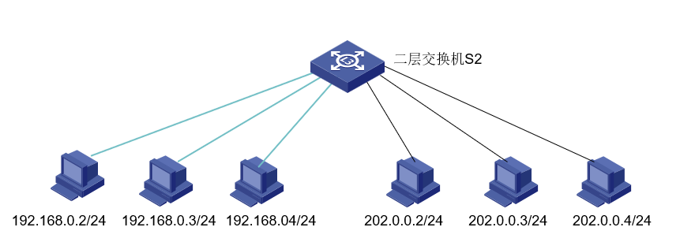
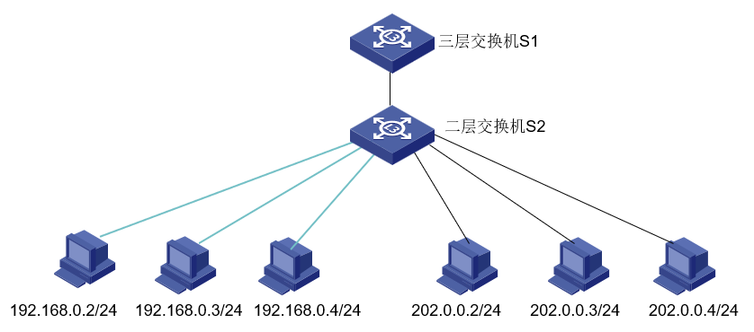
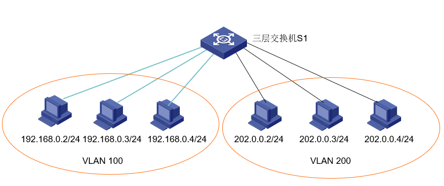

什么是网关 Gateway

网关(Gateway)又称网间连接器、协议转换器。网关在**传输层**上以实现网络互连，是最复杂的网络互连设备，仅用于两个**高层协议不同的**网络互连。网关的结构也和路由器类似，**不同的是互连层**。网关既可以用于广域网互连，也可以用于局域网互连。

顾名思义，网关(Gateway)就是一个网络连接到另一个网络的“关口”。如三层交换机或路由器等。

## 实验目的

- 进一步理解三层交换机配置的基本原理。
- 掌握三层交换机的基本命令配置。
- 掌握不同组网通信含义。

## 实验原理

系统视图下：

- `interface vlan-interface <vlan_id>`：创建VLAN 接口或进入VLAN 接口视图。（Undo 删除）

  > - VLAN接口视图和VLAN视图是不同的；
  >
  > - VLAN路由接口（或简称VLAN接口）与VLAN具有对应关系,是整个VLAN的逻辑接口,只有在已经建立了某个VLAN的情况下，才能为该VLAN建立路由接口。
  >
  > - 在2层交换机上,由于只有一个默认VLAN（VLAN1），只能为 vlan 1 建立路由接口，而在三层交换机下，可以为每个VLAN建立一个逻辑接口。

接口视图下：

- `ip address ip-address net-mask (sub)`：给 VLAN 接口指定 IP 地址和掩码。

## 实验步骤

### 实验1：在三层交换机上实现不同网段相同VLAN计算机互联

STEP 1：按图示搭建网络环境,每6人为一组,均通过网线连接在2层交换机S2的1-6号口。为各计算配置IP地址，同侧的三台计算机在同一网段，然后用ping命令测试其连通性，六台计算机属于同一VLAN的情况下属于同一网段的计算机应该都能连通。

STEP 2：将二层交换机S2级联到三层交换机S1，在S1上创建VLAN路由接口，并在VLAN接口视图下配置路由接口的主从IP地址，然后测试不同网段间计算的连通性。

1. `system-view`：进入系统视图

2. 链接三层交换机 S1，建立 vlan 1 的接口视图，并设置其 ip 地址：

   1. `vlan 1`：进入 vlan 1 视图

   2. `interface vlan 1`：为 vlan 1 创建路由接口
   3. `ip address 192.168.0.1 255.255.255.0`：为 vlan 1 的路由接口配置IP地址
   4. `ip address 202.0.0.1 255.255.255.0 sub`：为 vlan 1 的路由器接口配置子IP地址

3. 使用 `ping` 命令测试连通性。

### 实验2：不同网段不同VLAN的计算机互联

STEP 1：按图示搭建网络环境，每6人为一组，均通过网线连接在2层交换机 S2 的 1-6 号口。为各计算配置IP地址，同侧的三台计算机在同一网段同一VLAN。然后用 ping 命令测试其连通性，同侧三台计算机应该能连通。

STEP 2：在交换机 S1 上，建立 VLAN 100 和 VLAN 200 的路由接口，并分别设置ip地址，该ip应和VLAN内的计算机 ip 地址处于同一网段内。将计算机网段地址设置为对应的VLAN接口地址，通过ping命令测试其连通性。

1. `vlan 100`：创建 vlan 100 并进入其视图
2. `port e1/0/1 to e1/0/3`：将1-3号以太口加入VLAN100
3. `vlan 200`：创建 vlan 200 并进入其视图
4. `port e1/0/4 to e1/0/6`：将4-6号以太口加入VLAN200
5. `int vlan 100`：创建vlan100的路由接口
6. `ip address 192.168.0.1 255.255.255.0`：配置IP地址
7. `int vlan 200`：创建vlan200的路由接口
8. `ip address 202.0.0.1 255.255.255.0`：配置IP地址